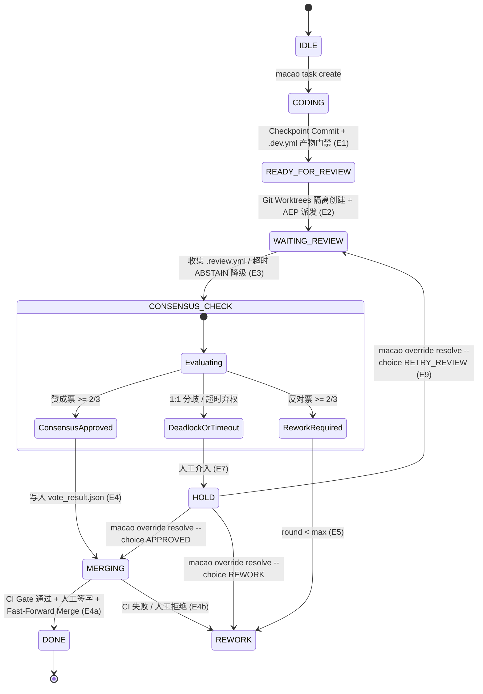

# MACAO (Multi-Agent CLI Agent Orchestrator)

> **标准化流程 + 显式产物信号驱动的生产级多 AI CLI 编排框架**

[](https://github.com/hunterlau2020/macao)
[](https://github.com/hunterlau2020/macao)
[](docs/reviews/STATUS.md)
[](LICENSE)


---

## 📖 概览 (Overview)

**MACAO** 是一个专为 AI 编程团队打造的、非侵入式的多 Agent CLI 编排器。它将多个原生的 AI 命令行工具（如 **Claude Code、Codex CLI、OpenCode、Google Antigravity (agy)、Cursor Agent (agent)、Kimi**）组合为一个结构严密、具备确定性共识仲裁、物理工作区隔离与自动合入的协同网络。

### 核心设计原则
1. **0% LLM 确定性核心**：状态机推进（FSM）、Draft-07 Schema 门禁、2/3 多数票算术、Git Fast-Forward 合并与不可变审计账本全由纯代码驱动，杜绝编排器本身产生幻觉。
2. **边缘大模型智能 (Agentic Edge)**：由被调度的各个 Agent CLI 自带先进大模型（Claude 3.7 Sonnet, OpenAI o3-mini, Gemini 2.0 Pro, DeepSeek-V3/R1, Qwen 2.5/3.8, GLM-5 等）。
3. **PTY-Wrapper 零插件侵入**：通过原生虚拟终端（PTY）封装运行原生 CLI，无需在被管项目中安装任何魔改 Hook 或 Plugin。
4. **两级输出自愈 (Two-Level Output Self-Healing)**：自动剥离 ANSI 颜色码与客套话，提取 Markdown 代码块并实施 Draft-07 先验校验与缺省对齐。
5. **Git Worktree 物理隔离**：为每位审查员在 `.macao/worktrees/` 创建专属独立工作区，审查过程零冲突、零污染，评审结束后原子清理（`--force`）。

---

## 🚀 快速上手 (Quickstart)

### 1. 安装与预检
```bash
# 克隆仓库并安装
git clone https://github.com/hunterlau2020/macao.git
cd macao
pip install -e .

# 检查系统 AI CLI 与 Git/SQLite 环境
macao preflight
```

### 2. 智能向导初始化 (`macao setup`)
在您的项目根目录中运行智能向导，自动探测已安装的 AI 工具、项目分支与测试命令：
```bash
macao setup --executor opencode --model "GLM 5.3 max"
```

该命令会自动：
* 探测本机可用 CLI（OpenCode, Claude Code, Codex, Antigravity, Cursor, Kimi）并智能推荐团队配置；
* 生成符合 Draft-07 Schema 严格校验的 `macao.yaml`；
* 自动在项目的 `.gitignore` 中追加 `.macao/worktrees/` 和 `*.db` 隔离项，防止污染代码库。

### 3. 运行端到端协同验证 (`macao live-run`)
```bash
# 执行完整的 7 步微任务协同流水线
macao live-run
```

---

## 🛠️ CLI 命令行工具集 (Command Reference)

| 命令 | 用途与说明 |
|---|---|
| `macao setup` | 智能环境自检向导，交互式探测并生成定制化 `macao.yaml` |
| `macao init` | 生成标准的 `macao.yaml` 配置文件模板 |
| `macao doctor` | 静态配置诊断、SQLite 状态库检查与 CLI 就绪度诊断 |
| `macao preflight` | 实时探活系统安装的各 AI CLI、版本、权限模式与通信总线 |
| `macao test-clis` | 真实拉起各 CLI 的 PTY 伪终端沙箱，测试 ANSI 清洗与 0 僵尸进程清理 |
| `macao task create` | 发起协同开发任务（注入任务标题、验收标准、开发分支与目标分支） |
| `macao status` | 终端 Rich 彩色看板：展示当前 FSM 阶段、检查点 Commit、各 Agent 产物与投票进度 |
| `macao daemon` | 启动后台超时自动扫描守护进程（`--once` 支持单次扫描） |
| `macao override resolve`| 当出现死锁、超时或未知异常时，人工一键裁决（`APPROVED` / `REWORK` / `RETRY_REVIEW` / `CANCEL`） |
| `macao merge approve` | 最终合入主干前的人工签字放行确认（安全保守默认开启） |
| `macao live-run` | 运行 Phase 3 生产级多 Agent 真实协同微任务全闭环演练 |

---

## ⚙️ 配置文件规范 (`macao.yaml`)

```yaml
project:
  name: "my-project"
  repository:
    workspace_path: "."
    remote_name: "origin"
    default_branch: "main"

team:
  # 执行者配置（支持 opencode / agy / claude-code / agent 等）
  executor:
    id: "dev-agent"
    cli: "opencode"
    adapter: "pty-wrapper"
    model: "GLM 5.3 max"       # 自动向底层 CLI 透传 -m "GLM 5.3 max"

  # 多元独立代码审查团
  reviewers:
    - id: "rev-opencode"
      cli: "opencode"
      adapter: "pty-wrapper"
      model: "Qwen3.8 max"      # 自动向底层 CLI 透传 -m "Qwen3.8 max"

    - id: "rev-cursor"
      cli: "agent"              # Cursor Agent CLI (/home/debian/.local/bin/agent)
      adapter: "pty-wrapper"
      model: "claude-3-5-sonnet"# 自动透传 --model claude-3-5-sonnet

    - id: "rev-agy"
      cli: "agy"                # Google Antigravity CLI
      adapter: "pty-wrapper"
      model: "gemini-2.0-pro"   # 自动透传 --model gemini-2.0-pro

    - id: "rev-codex"
      cli: "codex"
      adapter: "pty-wrapper"
      model: "o3-mini"          # 自动透传 -m o3-mini

policy:
  consensus_rule: "2/3_majority"
  min_effective_votes: 3
  max_rework_rounds: 3
  review_strategy: "delta_plus_focus"

merge:
  strategy: "ff_only"
  ci_gate_command: "pytest -q"  # 合并前自动执行的测试门禁（如 npm test / cargo test）
  require_human_signoff: true   # 推送前是否要求人类最终签字
  rebase_before_merge: false

timeouts:
  development: "2h"
  checkpoint_validation: "1m"
  review_request: "30m"
  per_reviewer: "10m"
  consensus_check: "1m"
```

---

## 🏛️ 状态机与工作流 (FSM Architecture)



---

## 📚 延伸文档 (Documentation)

* **常见问题与架构设计指南**：[`docs/FAQ.md`](docs/FAQ.md)
* **产品需求与规格说明书**：[`docs/MACAO_PRD_v2.md`](docs/MACAO_PRD_v2.md)
* **评审专家委员会门禁状态**：[`docs/reviews/STATUS.md`](docs/reviews/STATUS.md)
* **评审规范与方法论**：[`docs/reference/MACAO_REVIEW_GUIDELINES.md`](docs/reference/MACAO_REVIEW_GUIDELINES.md)

---

## 📄 开源许可证 (License)

本项目基于 [MIT License](LICENSE) 许可证开源。
