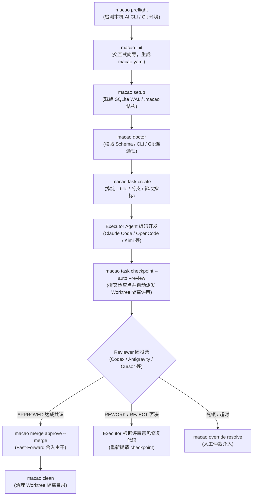

# MACAO 实战操作与命令参考手册 (CLI Operational Guide)

本文档是 **MACAO (Multi-Agent CLI Agent Orchestrator)** 的实战操作手册，涵盖从项目接入、环境探测、交互式配置、任务全生命周期调度（创建/提测/独立隔离评审/共识合入）、多 Agent 原生会话日志追踪，到故障回退清理的完整方法论与命令参考。

---

## 目录

- [一、端到端标准实战流程图](#一端到端标准实战流程图)
- [二、环境探测与项目接入 (Phase 1)](#二环境探测与项目接入-phase-1)
  - [1. macao preflight（只读环境探活）](#1-macao-preflight只读环境探活)
  - [2. macao init（交互式向导配置）](#2-macao-init交互式向导配置)
  - [3. macao setup（基础设施就绪）](#3-macao-setup基础设施就绪)
  - [4. macao doctor（项目健康体检）](#4-macao-doctor项目健康体检)
- [三、协同任务调度与管理 (Phase 2)](#三协同任务调度与管理-phase-2)
  - [1. macao task create（创建任务与参数深度剖析）](#1-macao-task-create创建任务与参数深度剖析)
  - [2. macao status（实时看板监控）](#2-macao-status实时看板监控)
  - [3. macao task checkpoint（提请评审与隔离派发）](#3-macao-task-checkpoint提请评审与隔离派发)
  - [4. macao task recover（磁盘与状态自愈对齐）](#4-macao-task-recover磁盘与状态自愈对齐)
  - [5. macao task cancel（取消任务）](#5-macao-task-cancel取消任务)
- [四、多 Agent 隔离评审与共识合入 (Phase 3)](#四多-agent-隔离评审与共识合入-phase-3)
  - [1. Git Worktree 物理隔离机制](#1-git-worktree-物理隔离机制)
  - [2. 2/3 法定人数与加权计票](#2-23-法定人数与加权计票)
  - [3. macao merge approve / execute（主干合入）](#3-macao-merge-approve--execute主干合入)
  - [4. macao override resolve（人工干预接管）](#4-macao-override-resolve人工干预接管)
- [五、全链路日志、审计与清理回退 (Phase 4)](#五全链路日志审计与清理回退-phase-4)
  - [1. macao logs（全链路与各 Agent 原生会话日志）](#1-macao-logs全链路与各-agent-原生会话日志)
  - [2. macao audit（不可变状态账本）](#2-macao-audit不可变状态账本)
  - [3. macao clean（隔离区清理与一键重置回退）](#3-macao-clean隔离区清理与一键重置回退)

---

## 一、端到端标准实战流程图



---

## 二、环境探测与项目接入 (Phase 1)

在已有项目（例如 `/home/debian/english_learning_system`）或新项目中接入 MACAO，按以下步骤执行：

### 1. macao preflight（只读环境探活）

* **定位**：纯只读探活。无需 Git 仓库，也无需预先存在 `macao.yaml`。
* **功能**：自动扫描系统 `PATH`，检测 **Claude Code、Codex CLI、OpenCode、Google Antigravity (agy)、Cursor Agent (agent)、Kimi** 6 款原生 AI CLI 是否安装、版本号、执行模式，并检查 Git 与 SQLite WAL 支持。
* **命令**：
  ```bash
  macao preflight
  ```

### 2. macao init（交互式向导配置）

* **定位**：在项目根目录生成符合 Draft-07 Schema 的主配置文件 `macao.yaml`。
* **功能亮点**：
  1. **项目名智能识别**：自动读取当前项目文件夹名称（如 `english_learning_system`），按回车直接采纳。
  2. **Git 信息智能探测**：自动提取当前 Git 远端名（默认 `origin`）和默认主分支（自动识别 `main` 或 `master`）。
  3. **AI 评审团队智能推荐**：
     - 自动检测系统中已安装的 CLI。
     - 支持极简输入：输入数字 `4` 代表选前 4 位、范围 `1-4`、或逗号分隔的名称 `opencode, agy, cursor`。
     - 强制门禁：最少选择 2 位评审者以确保跨模型互审。
     - 自动计算法定仲裁阈值：若选择 4 位 Reviewer，自动将 `seat_quorum_required`、`minimum_winning_seats` 与 `weight_quorum_required` 设为 3（2/3 多数原则）。
  4. **全中文详尽注释**：生成的 `macao.yaml` 每一个字段均带中文用途说明。
* **命令**：
  ```bash
  macao init
  # 若已有配置文件，强制覆盖重置可使用：
  macao init --force
  ```

### 3. macao setup（基础设施就绪）

* **定位**：一键就绪 MACAO 运行时所需的底层基础设施。
* **功能**：
  - 初始化 `.macao/state.db`（开启 WAL 模式、设置 Busy Timeout 5000ms）。
  - 创建 `.macao/worktrees/` 隔离目录与 `.macao/logs/` 日志目录。
  - 在 `.gitignore` 中自动追加防泄露与隔离目录配置。
  - 此操作具有**幂等性**，多次执行安全无副作用。
* **命令**：
  ```bash
  macao setup
  ```

### 4. macao doctor（项目健康体检）

* **定位**：综合环境与配置一致性门禁检查。
* **功能**：
  - 静态校验 `macao.yaml` 是否满足 PRD §13 Draft-07 严格约束。
  - 动态验证所有在配置中指定的 Executor 和 Reviewer CLI 是否能在本系统成功唤起。
  - 验证 Git 分支是否干净，SQLite 状态库与 WAL 模式是否就绪。
* **命令**：
  ```bash
  macao doctor
  ```

---

## 三、协同任务调度与管理 (Phase 2)

### 1. macao probe / macao task probe（动态状态探测、工作区定位与派发前置检视）

* **为什么需要前置动态探测？**
  在多 Agent 协同体系中，盲目派发任务是极其危险的。如果不做动态状态探测：
  1. 不清楚当前项目配置的执行者（Executor）与审查团（Reviewers）是否安装、连通、处于空闲还是正在作业。
  2. 不清楚执行者当前位于哪个工作区/分支/提交，当前工作进度到哪一步（是处于编码中 `CODING_IN_PROGRESS`，还是已生成提审检查点 `CHECKPOINT_SUBMITTED`）。
  3. 不清楚审查员是否已分配独立的 Git Worktree 沙箱、沙箱是否真实存在于磁盘、当前审查状态是未开始、审查中（`IN_PROGRESS`）还是已完成投票（`COMPLETED`）。
  4. 不清楚审查团（Reviewers）是否有足够的健康席位满足法定仲裁（Quorum）门槛（若 4 人评审团有 2 个 CLI 无法唤起，则 3 票仲裁门槛永远无法达成，任务必然死锁）。
  5. 在接管现有项目时，需要验证只读状态，确保探测过程**绝对不修改或创建 `state.db`**。

* **命令用法**：
  ```bash
  # 基础动态探测（只读幂等）
  macao probe

  # 显式只读预检模式（严格保证不对 state.db 或 Git 进行任何修改/创建，适合脚本与CI测试）
  macao probe --dry-run

  # JSON 结构化机器可读输出（用于自动化探活管道）
  macao probe --json

  # 兼容任务子命令别名
  macao task probe [--dry-run] [--json]
  ```

* **终端探测报告全景解析**：
  运行后系统输出结构化审计矩阵：
  1. **Configured Executor（开发执行者状态与进度）**：
     - **CLI 工具与原生会话（Native Session Discovery）**：如 `dev-agy (agy)`、版本号、探活状态（`READY` / `MISSING`），以及通过 `SessionLocator` 自动发现的底层原生活跃 Session ID（无需调用 LLM，毫秒级定位）。
     - **当前工作区（Current Worktree）**：主仓库物理路径、Git 当前工作分支、最新 HEAD Commit Hash、分支干净度（`clean` 或脏文件计数）。
     - **工作进度三元组（Progress Triplet: Last / Now / Next）**：
       - `Last`: 上一个已完成的任务或功能提交（由 Git 提交历史自动提取）。
       - `Now`: 当前正在进行的工作（例如待评审请求 `Pending Review Request: <file>`，或 `Active Coding` 脏改动）。
       - `Next`: 下一步计划（如等待审查员裁决 `Awaiting Reviewers: [...]`，或待派发下一阶段任务）。
  2. **Configured Reviewers（审查团席位、真实工作区与评审进度）**：
     - **审查员席位与权重**：如 `rev-opencode (1.0)`、`rev-cursor (1.0)` 等，及探活就绪状态。
     - **真实工作区检测（True Worktree Detection）**：通过 `git worktree list --porcelain` 探查真实工作树。若单仓库原地开发评审，准确展示为 `In-repo (Shared Workspace / Direct Review)`；若存在独立 Worktree，展示其实际物理路径；**绝不硬编码虚假路径或 `(NOT_SPAWNED)` 假象**。
     - **评审进度（Review Progress）**：主动检索物理评审产物（`docs/reviews/`），准确反映真实评审状态（`AWAITING_REVIEW (@ <commit>)`、`APPROVED`、`CHANGES_REQ` 等）。
  3. **Workspace & Consensus Readiness（工作区与共识法定人数）**：
     - **Git Repository**：分支名、HEAD 提交及未暂存文件统计。
     - **State Store**：显示 `.macao/state.db` 状态（`CONNECTED (RO)` 只读直连，或未初始化时显示 `NOT_INITIALIZED`，绝不擅自创建空数据库）。
     - **Active Task**：当前活跃任务 ID、标题、轮次与 FSM 状态。
     - **Consensus Quorum**：就绪审查者数与法定仲裁门槛（如 `4/4 Ready (Required: 3) -> ACHIEVABLE`）。
  4. **探活审计日志与行动指引（Audit Trail & Guidance）**：
     - 每次 probe 均记录完整探测链路至 `.macao/logs/probe/probe_<timestamp>.log`，支持 `macao logs --probe` 随时回溯。
     - 通过状态给出明确下一步建议（如 `macao task create`、`macao task checkpoint` 或 `macao merge approve`）。


---

### 2. macao task create（创建任务、动态预检与派发确认）

创建并启动一个多 Agent 协同的开发任务。默认会在真正创建前自动执行动态探测门禁（Fail-closed）。

```bash
macao task create [OPTIONS]
```

#### 参数解析矩阵

| 参数 | 类型 | 是否必填 | 默认值 | 作用与角色 |
| :--- | :--- | :--- | :--- | :--- |
| **`--title`** | 字符串 | **核心必填** | 无（交互终端会友好提示输入） | **任务简短标题 / 需求名称**。相当于 Git PR 标题、Jira 需求摘要。 |
| **`--description`** | 字符串 | 可选 | 默认取 `--title` | **详细需求描述**。包含业务上下文、设计思路、技术要点。 |
| **`--acceptance`** | 字符串 | 可选 | 空 | **验收标准**。审查者验证通过的准则（如测试通过、覆盖率）。 |
| **`--branch`** | 字符串 | 可选 | `feature/task-01` | 本次开发的特性分支名称。 |
| **`--target`** | 字符串 | 可选 | `main` | 最终通过评审后合并的目标主干分支。 |
| **`--dry-run`** | 标志位 | 可选 | False | **纯预检模式**。仅执行动态探测与派发规划，不创建任务。 |
| **`--probe / --no-probe`** | 标志位 | 可选 | `--probe` (开启) | 是否在创建任务前执行动态探测门禁。 |
| **`-f / --force`** | 标志位 | 可选 | False | 强制创建（跳过活跃任务冲突或非致命警告）。 |

#### `--title` 在系统底层的作用机制
1. **状态持久化**：写入 `.macao/state.db` 的 `tasks` 表，作为该次任务展示给开发者的主标题。
2. **终端看板展示**：在 `macao status` 界面顶部状态栏直接渲染。
3. **分发给 Executor 的开发指引**：MACAO 向执行 Agent（如 Claude Code、OpenCode）广播 `DEVELOPMENT_STARTED` 协议信封时，`title` 作为 specification summary，告知执行 Agent 本次要实现的核心目标。
4. **评审申请文档标题**：在提请评审时，自动作为 `docs/reviews/review-request-{task_id}.md` 的一级大标题（`# Review Request: {title}`）。

#### 实战调用示例

* **方式 A：执行前纯探测与规划（--dry-run）**
  ```bash
  # 仅测试当前团队与环境状态，明确派发目标，不写数据库
  macao task create --dry-run
  ```

* **方式 B：标准工程实战创建（自动通过动态预检后派发）**
  ```bash
  macao task create \
    --title "增加每日单词打卡与进度统计API" \
    --description "为英语学习系统增加打卡接口与每日词汇量统计，包含数据持久化与错误处理" \
    --acceptance "1. pytest 单元测试全部通过; 2. 接口支持按日期查询打卡状态; 3. 正确率计算无精度问题" \
    --branch "feature/daily-checkin"
  ```
  创建成功后，控制台将明确输出派发结果：
  ```text
  ✓ Task 'task-20260906-xxxx' successfully created!
    Title            : 增加每日单词打卡与进度统计API
    Assigned Executor: dev-agy (agy) (in charge of implementation)
    Assigned Reviewers: 4 independent agents (Worktree isolated)
    Branch           : feature/daily-checkin -> main
    Initial State    : CODING
  ```

* **方式 C：终端交互输入**
  直接敲 `macao task create`，系统在完成预检后提示输入标题：
  ```text
  Task title: 增加每日单词打卡与进度统计API
  ```

---

### 2. macao status（实时看板监控）

查看当前正在进行的协同任务看板：
```bash
macao status
```
看板直观展示：
- **Task 元数据**：Task ID、Title、状态机当前状态（如 `IN_DEVELOPMENT`、`IN_REVIEW`、`APPROVED`、`MERGING`）、轮次 Round。
- **分支与 Commit**：当前特性分支、基线 Commit 与最新 HEAD Commit。
- **产物信号**：`.macao/.dev.yml`、`docs/reviews/` 等是否生成。
- **Review 计票进度**：各个 Reviewer 的投票结论（`APPROVE` / `REJECT` / 等待中）与 Quorum 达成情况。

---

### 3. macao task checkpoint（提请评审与隔离派发）

当执行者（Executor）完成代码编写并提交 Git commit 后，调用此命令提交开发检查点：

```bash
# 自动生成 .dev.yml 并自动唤起所有 Reviewer 进行 Worktree 隔离审查
macao task checkpoint --auto --review
```

* **`--auto`**：若当前尚未手动编写 `.macao/.dev.yml`，系统自动从当前 Git HEAD 提交中提取 commit hash 与分支信息，自动生成标准的 `.dev.yml` 与 `docs/reviews/review-request-{task_id}.md`。
* **`--review`**：自动启动审查流水线。MACAO 会为每一个 Reviewer 在 `.macao/worktrees/` 创建专属独立工作区，并行拉起各个 AI CLI（Codex、Cursor Agent、Antigravity、OpenCode 等）进行静态审查并收集 `.review.yml` 报告。
* **`--timeout <秒数>`**：设置每位 Reviewer 的独立超时时间（默认 120 秒）。

---

### 4. macao task recover（磁盘与状态自愈对齐）

* **定位**：当发生异常断电、进程被 kill、或直接在外部进行了 Git 操作时，实现状态自愈。
* **功能**：扫描磁盘实际文件（`.dev.yml`, `docs/reviews/*.md`, `vote_result.json`）与 Git commit 历史，对齐 SQLite 数据库状态。
* **命令**：
  ```bash
  macao task recover
  ```

---

### 5. macao task cancel（取消任务）

中止当前正在进行中的任务，重置状态并安全清理临时分支与工作区：
```bash
macao task cancel
```

---

## 四、多 Agent 隔离评审与共识合入 (Phase 3)

### 1. Git Worktree 物理隔离机制

评审过程中，各个 Reviewer 绝对不会在当前工作区直接检出或修改代码。
- MACAO 通过 `git worktree add --detach .macao/worktrees/rev-{id} <commit>` 为每位审查员创建**物理隔离目录**。
- 审查员在专属隔离工作区内只读分析、运行检查命令并输出独立评审报告。
- 评审结束后，系统自动执行 `git worktree remove --force` 清理，确保宿主工程零污染。

### 2. 2/3 法定人数与加权计票

- 评审结论仅读取审查者输出的 `.review.yml`（摘要格式），不直接依赖不可预测的自然语言长文。
- 编排器按纯数学逻辑计票：
  - 只有当赞成票达到配置的 `minimum_winning_seats`（如 4 人团队需 3 票）且总权重达标，状态机才转移至 `APPROVED`。
  - 若赞成票未达标或存在严重缺陷，状态自动转为 `REWORK`（返工），由执行者根据评审意见进行修复并推进至下一轮（Round 2）。

### 3. macao merge approve / execute（主干合入）

当任务达成共识（`APPROVED`）后：

```bash
# 审批并一键执行 Fast-Forward 合入主干
macao merge approve --merge

# 或分步执行：
macao merge approve   # 记录人工放行签字
macao merge execute   # 执行真正的 Git Fast-Forward 合并
```

### 4. macao override resolve（人工干预接管）

若多 Agent 之间出现死锁、连续多次返工达到上限、或 CLI 发生不可恢复的超时错误，人工管理员可一键接管决策：

```bash
macao override resolve --decision APPROVED --reason "架构师人工代码复核通过"
# 可选决策值: APPROVED / REWORK / RETRY_REVIEW / CANCEL
```

---

## 五、全链路日志、审计与清理回退 (Phase 4)

### 1. macao logs（全链路与各 Agent 原生会话日志）

MACAO 具备多层级日志系统：

```bash
# 1. 查看编排系统主流水日志 (默认输出最近 50 行)
macao logs

# 2. 实时动态跟踪日志 (-f / --follow)
macao logs -f

# 3. 查看特定评审者 (Reviewer) 在 Worktree 隔离运行时的原始 PTY 会话日志
macao logs -r rev-opencode
macao logs -r rev-cursor

# 4. 查看当前任务所有 Reviewer 的交互日志
macao logs -r

# 5. 查看执行者 (Executor) 的原始 PTY 交互会话
macao logs -e

# 6. 查看最近一次动态探活 (Probe) 的完整审计日志
macao logs --probe
# 简写模式
macao logs -p
```

### 2. macao audit（不可变状态账本）

查看持久化在 SQLite 中的不可变审计事件（包含每一轮的状态跃迁、检查点提交、各 Reviewer 选票明细与时间戳）：

```bash
macao audit
```

### 3. macao clean（隔离区清理与一键重置回退）

在任务完成或调试需要重置时，执行安全清理：

```bash
# 1. 默认清理：仅清理已完成任务残留的 Git Worktree 隔离工作区
macao clean

# 2. 完全回滚重置 (--all)
# 将自动把现有 .macao 运行时与配置备份为 .macao.bak.TIMESTAMP，随后清空运行时状态
macao clean --all

# 3. 恢复最近一次备份
macao clean --restore
```

---

## 附：常用排错清单速查

| 现象 | 可能原因 | 推荐解决命令 |
| :--- | :--- | :--- |
| `Missing option '--title'` | 任务创建时未指定标题 | 重新运行 `macao task create --title "..."` 或交互输入 |
| `Doctor check failed` | 缺少某些 CLI 或 `macao.yaml` 配置有误 | 运行 `macao preflight` 查探活，`macao init --force` 重新生成配置 |
| 无法创建新任务（已存在活跃任务） | 上一个任务仍在开发或评审中 | 运行 `macao status` 确认，或 `macao task cancel` 取消旧任务 |
| 状态与实际分支代码脱节 | 手动修改了 git 或意外断电中断 | 运行 `macao task recover` 进行状态自愈 |
| 想查看某审查员为什么打了 REJECT 票 | 需要查看审查员的原始输出日志 | 运行 `macao logs -r <reviewer_id>` 或查看 `docs/reviews/` |
