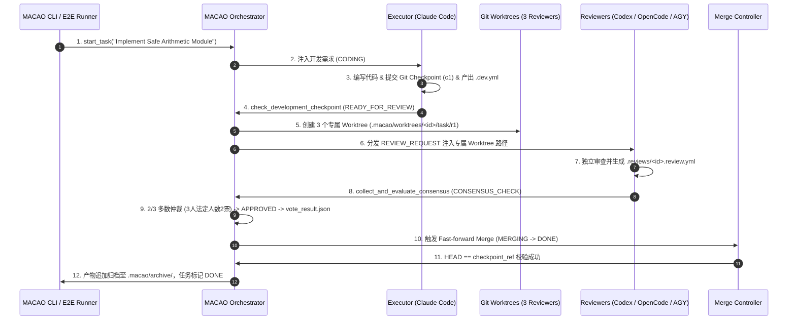

# MACAO 第二阶段受控实机端到端协同联调方案 (Controlled E2E Integration Phase 2)

> **版本**：v1.0 (2026-08-28)  
> **目标**：验证从任务创建、Executor 开发提交、三方 Reviewer（Codex / OpenCode / AGY）专属 Worktree 物理隔离审查、2/3 多数仲裁到 Fast-forward 合并与终态归档的 **完整端到端闭环**。  
> **安全准则**：微型任务、零主分支污染、强类型 Schema 门禁、原子合并硬校验。

---

## 一、微型联调任务设计 (Micro-Task Specification)

为确保联调过程确定性高、耗时短（<15秒）且无无谓 Token 消耗，定义微型标准任务：

- **任务 ID**：`task-micro-calc`
- **任务标题**：`Implement Safe Arithmetic Module with Unit Tests`
- **源分支**：`feature/micro-calc` $\to$ **目标分支**：`main` (或 `test-target-main`)
- **交付内容**：
  1. `src/macao_demo/calc.py`：实现 `add(a, b)` 与 `subtract(a, b)`
  2. `tests/test_calc.py`：实现对应测试用例
  3. `.macao/.dev.yml`：开发产物清单，包含变更文件、测试通过标志与 commit SHA。

---

## 二、端到端四阶段全链路流转



---

## 三、关键安全与一致性门禁核验点

1. **产物物理真理源校验**：
   - 必须通过 `validate_dev_manifest`、`validate_review_manifest` 与 `validate_vote_result` 校验。
2. **Worktree 路径隔离与 Fail-closed**：
   - 3 位 Reviewer 必须被注入各自独立的绝对路径，严禁任何 Reviewer 访问主工作区。
3. **2/3 多数仲裁与去重**：
   - 3 位 Reviewer 投出 3 票（全部 `YES_APPROVE`），满足 $\ge 2$ 票法定人数，计算得出 `APPROVED`。
4. **Merge 安全硬校验**：
   - 校验快进合并是否成功，校验目标分支最新 commit 是否精确等于 Executor 提交的 `checkpoint_ref`。
5. **产物非覆盖追加归档**：
   - `.macao/archive/` 中完整保留该轮次的 `.dev.yml`、全部 `.review.yml` 与 `vote_result.json`。

---

## 四、CLI 执行命令

```bash
# 运行完整的第二阶段端到端受控协同闭环（带实时 Rich 仪表盘）
PYTHONPATH=src python3 -m macao.cli.main e2e-run
```
