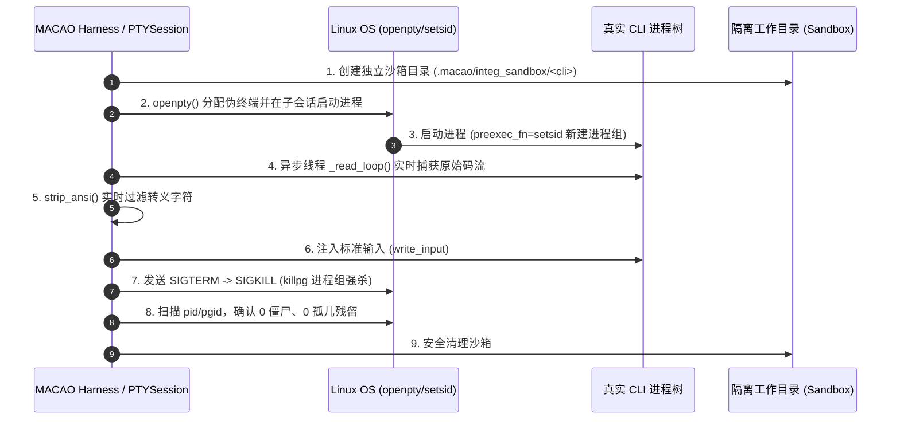

# MACAO 真实 AI CLI 第一阶段受控联调设计方案 (Controlled Integration Plan)

> **版本**：v1.0 (2026-08-27)  
> **目标**：验证 4 款真实 AI CLI（`claude-code`, `codex`, `opencode`, `agy`）在 Linux 宿主环境下的 PTY 进程启停、ANSI 码流捕获清洗与进程树安全回收。  
> **安全准则**：严格受控、单步机验、超时熔断（10s）、只读/沙箱目录运行、零残留进程。

---

## 一、联调对象与环境矩阵

| 序号 | 目标 Agent CLI | 系统执行路径 | 探测版本 | 联调角色定位 | 验证模式 |
|:---:|---|---|---|---|---|
| **1** | **Claude Code** | `/home/debian/.nvm/versions/node/v24.15.0/bin/claude` | `2.1.247` | Executor (主力开发) | PTY 交互会话 |
| **2** | **Codex** | `/home/debian/.nvm/versions/node/v24.15.0/bin/codex` | `2.1.0` | Reviewer 1 (代码审查) | Worktree 沙箱 |
| **3** | **OpenCode** | `/home/debian/.opencode/bin/opencode` | `1.18.23` | Reviewer 2 (代码审查) | Worktree 沙箱 |
| **4** | **Google Antigravity** | `/home/debian/.local/bin/agy` | `1.1.22` | Reviewer 3 (代码审查/扩展) | Worktree 沙箱 |

---

## 二、第一阶段联调四大验证目标



---

## 三、逐项验证用例与验收指标

### 用例 1：PTY 伪终端分配与进程组隔离 (Process Group Isolation)
- **目标**：验证 `openpty()` 成功分配 master/slave，且子进程通过 `os.setsid()` 拥有独立的 Process Group ID (`pgid`)。
- **验收标准**：`pgid != os.getpid()`，且 `master_fd` 正常读写。

### 用例 2：ANSI 码流实时清洗与日志捕获 (ANSI Stripping)
- **目标**：针对真实 CLI 输出的高频 ANSI 颜色转义符、光标跳转符（`\033[...`），验证清洗引擎。
- **验收标准**：清洗后的日志为标准纯文本 UTF-8 字符串，无乱码、无未决控制符。

### 用例 3：进程树强杀与资源零残留 (Clean Process Tree Termination)
- **目标**：测试在 CLI 运行中主动调用 `session.terminate(timeout_sec=3.0)`。
- **验收标准**：
  1. 向 `pgid` 发送 `SIGTERM` 后在 3 秒内退出；
  2. 超时未退出的兜底发送 `SIGKILL`；
  3. 执行 `os.kill(pid, 0)` 确认抛出 `ProcessLookupError`（进程已死亡）；
  4. 宿主系统无任何孤儿 node/python 子进程遗留。

### 用例 4：专属工作目录与只读隔离 (CWD Sandboxing)
- **目标**：验证 CLI 执行时的当前工作目录 (`cwd`) 严格绑定到独立沙箱，绝不触碰主代码仓。
- **验收标准**：主工作区无任何临时文件产生。

---

## 四、受控执行工具与 CLI 命令设计

我们在 MACAO CLI 中新增专用的受控联调命令：
```bash
# 运行全部真实 CLI 探针与 PTY 连通性测试（带实时 Rich 报告与进程监测）
PYTHONPATH=src python3 -m macao.cli.main test-clis

# 或针对特定单款 CLI 执行精准受控验证
PYTHONPATH=src python3 -m macao.cli.main test-clis --cli claude
PYTHONPATH=src python3 -m macao.cli.main test-clis --cli codex
PYTHONPATH=src python3 -m macao.cli.main test-clis --cli opencode
PYTHONPATH=src python3 -m macao.cli.main test-clis --cli agy
```

---

## 五、异常回退与安全熔断机制 (Fail-safe Safeguards)

1. **单项执行超时熔断**：每个 CLI 会话最大允许运行时间硬编码为 **8 秒**，超时强制中断并报告 `TIMEOUT`；
2. **看门狗回收器**：在测试 Harness 中设置 `finally:` 清理块，无论测试抛出何种异常，均强制执行 `killpg` 与 `rmtree(sandbox)`；
3. **只读探针优先**：第一阶段绝不向大模型发起长文本生成或复杂文件修改，仅验证 CLI 交互管道与控制流。
