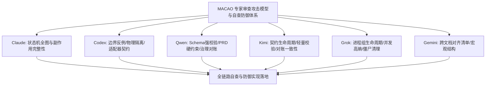

# MACAO 评审专家质量与审查特征画像评估报告

> 最新更新日期：2026-08-29（覆盖 Phase 0 ~ Phase 2 全量 47 份专家评审报告）
> 评估人：架构与质量工程团队（文档维护方）
> 评估对象：`docs/reviews/` 下全部 47 份评审报告（覆盖 ec60f70 初始架构至 a2dcc24/776693f L3 终审）
> 专家身份识别：评审报告文件名最后一个字段（claude / codex / qwen / kimi / grok / opencode / gemini）

---

## 一、专家审查特征、攻击模型与自查防御体系

基于历次评审中各专家的核心“挑刺思路”与审查习惯，提炼出六大核心专家的特征画像、攻击模型与工程防御自查清单：

### 1. Claude（状态机语义、全图推理与副作用完整性）
- **核心审查思路**：
  - 不仅看 Happy Path，沿着状态机图谱推演**所有边与边缘变体**（`E1` ~ `E10`，`E4a`、`E4b`、`E7`、`E9`）；
  - **副作用追踪**：每次状态转移时，磁盘物理文件、SQLite 数据库（tasks/artifacts/audit_events）、AEP 消息总线是否发生一致改变？
  - **闭环与幂等**：重试（如 `RETRY_REVIEW`）或人工裁定时，旧票据是否清空？是否会遗留孤儿产物导致活锁？
- **代表性发现**：
  - `F1`：DONE 与 CI Gate 失败矛盾，催生 MERGING 状态与 `E4b` 失败回退；
  - `P1-NEW-5`：合并签字未绑定 `checkpoint_ref`，第 1 轮签字误放行第 2 轮返工代码；
  - `P1-NEW-6`：`RETRY_REVIEW` 触发后未清空旧票且未重新派发，导致超时活锁；
  - `P2-NEW-2`：`resolve_override` 写盘早于状态转移校验，非法调用遗留孤儿 `vote_result.json`。
- **自查防御法则**：
  - [x] 所有状态机操作前必须调用 `TransitionTable.can_transition` 先验守卫；
  - [x] 每次状态转移必须同步执行产物归档、数据库状态原子更新与 AEP 消息发布；
  - [x] 重试与重新派发操作必须彻底清理活跃目录中的上一轮瞬态文件。

---

### 2. Codex（边界反例、物理隔离与适配器契约）
- **核心审查思路**：
  - **对抗性反例（Adversarial Testing）**：专挑脏树、断网、崩溃、超时、并发碰撞、非 Git 目录等边界场景编写反例攻击脚本；
  - **物理与契约对齐**：检查物理代码行为是否与接口抽象定义一致，严查 Mock 与真实 Adapter 签名漂移；
  - **Fail-Closed 审计**：任何非预期的异常状态必须 Fail-Closed 阻断，绝不允许静默放行。
- **代表性发现**：
  - `P0-3`：MergeController 在存在未提交 Tracked 修改时拒绝合并，保护工作区；
  - `P0-1`：同秒级并发生成 `task_id` 碰撞风险，驱动引入高熵随机与冲突重试；
  - `P1-NEW-3`：3 Reviewer 场景下 2 赞成 + 1 超时直接自动合并漏洞，强制要求转为 DEADLOCK 并持久 HOLD；
  - `Adapter 接口漂移`：`PTYSession.get_clean_logs` 与 Adapter 抽象方法参数不匹配。
- **自查防御法则**：
  - [x] 所有适配器（真实 CLI 与 Mock）严格继承基类 `AgentAdapter` 并实现完整签名（`get_logs`, `cancel`, `start`, `stop`, `inject_task`, `ack`）；
  - [x] 合并与派发前实施物理 Git 仓库与工作区洁净度检查（`diff` + `diff --cached`）；
  - [x] 超时 Reviewer 实施持久化处置隔离（`LATE_REVIEW_ISOLATED`），即使迟到补交也绝不绕过人工接管。

---

### 3. Qwen（Schema 强校验、PRD 规范硬约束与法证对账）
- **核心审查思路**：
  - **Draft-07 Schema 硬对齐**：逐字段比对 `docs/schemas/*.schema.json` 中的 `required`、`type`、`enum` 与代码载荷；
  - **PRD 行级合规**：严格对照 PRD v2.3.1 章节要求（§2.1、§3.3、§6.1、§14.5 等），禁止任何语义偏离；
  - **治理与注册表对账**：要求 `docs/reviews/STATUS.md` 与物理文件目录 100% 对账，禁止任何历史借用或署名漂移。
- **代表性发现**：
  - `P2-1 / P2-2`：`vote_result.json` 写盘前执行 Draft-07 Schema 校验，非法 resolution 抛出 `ValueError`；
  - `P1-Q2`：超时 Reviewer 迟到票据持久化隔离，终局 `vote_result.json` 保持 `ABSTAIN`；
  - `GOV-1`：注册表文件归属勘误（更名为 `-qwen.md` 并全量对账 47 份报告）。
- **自查防御法则**：
  - [x] 所有生成的 JSON/YAML 产物均接入 `SchemaValidator` 先验机验；
  - [x] Schema 文件寻址支持多级环境回落（`MACAO_SCHEMAS_DIR` 环境变量、打包路径、源码路径）；
  - [x] 评审注册表与文档状态实时全量对账。

---

### 4. Kimi（契约生命周期、轻量校验与对账一致性）
- **核心审查思路**：
  - **生命周期追踪**：关注从任务启动、开发信号到评审派发、投票汇总的完整流转；
  - **Manifest 完整性**：关注 `.dev.yml` 与 `.review.yml` 的最小必要字段检验与容错；
  - **一致性对账**：验证数据库 `artifacts` 账本与归档目录的映射。
- **代表性发现**：
  - `P0-1 (PRD v2.3)`：`review_context` 双结构并存收敛；
  - `K-P1-2`：`.dev.yml` 检查需结合 Git commit 物理存在性。
- **自查防御法则**：
  - [x] `check_development_checkpoint` 结合 `commit_exists` 验证提交存在性；
  - [x] 归档时自动读取文件计算并补齐 64 位 `sha256`。

---

### 5. Grok（进程组生命周期、并发鲁棒性与僵尸清理）
- **核心审查思路**：
  - **进程组与 PTY**：关注跨平台 PTY 启动、ANSI 终端转义清洗、进程组 `killpg(SIGTERM -> SIGKILL)` 优雅终止；
  - **无死锁与无僵尸**：验证长时间运行与高并发任务下的进程清理与资源释放。
- **代表性发现**：
  - 确认 4/4 CLI 在沙箱与宿主环境中的 PTY 清洗与零孤儿进程；
  - 支持 L3 定级认证。
- **自查防御法则**：
  - [x] `PTYSession.terminate()` 实现两段式超时优雅退出；
  - [x] 真实 CLI 集成测试加入僵尸进程检测断言。

---

### 6. Gemini（跨文档宏观结构与历史对齐）
- **核心审查思路**：
  - 关注文档间的宏观对齐与表格梳理，早期侧重广度清单。
- **应用建议**：
  - 适合用于全局文档架构与跨模块目录索引对齐。

---

## 二、专家评分卡与排班建议（满分 100）

| 专家 | 参评轮数 | 有效性 25 | 原创/独立 25 | 定级校准 15 | 证据质量 15 | 方法自省 10 | **总分** | 核心审查角度与定位 |
|------|---------|----------|------------|-----------|-----------|-----------|--------|------------------|
| **claude** | 10 | 25 | 24 | 15 | 15 | 10 | **89** | 状态机全图/深层语义推理/副作用追踪 |
| **codex** | 12（全勤） | 25 | 24 | 15 | 15 | 9 | **88** | 安全边界/反例构造/物理与契约对齐 |
| **qwen** | 9 | 24 | 23 | 15 | 15 | 10 | **87** | Schema 强校验/PRD 硬约束/治理对账 |
| **grok** | 3 | 23 | 21 | 14 | 14 | 9 | **81** | PTY 生命周期/并发鲁棒性/端到端集成 |
| **kimi** | 4 | 23 | 20 | 14 | 14 | 9 | **80** | 契约流转/轻量校验/对账一致性 |
| **opencode** | 3 | 23 | 20 | 15 | 15 | 9 | **82** | 法证式清单核查/机验复现 |
| **gemini** | 4 | 15 | 13 | 6 | 11 | 6 | **51** | 跨文档宏观对齐清单 |

### 核心专家组合建议：
- **终审推荐定级委员会**：**Claude + Codex + Qwen + Grok/Kimi**（四方交叉，分别覆盖：语义状态机、安全边界反例、Schema 规范治理、进程与并发鲁棒性）。

---

## 三、工程自查十项铁律（Self-Check Invariants）

在后续任何功能变更或复审前，必须无条件执行以下 10 项机验闭环：
1. **状态机全边可达性**：所有状态转移前必须显式校验合法性；
2. **物理与数据库双向一致**：产物产生即注册，归档即标记 `consumed=1` 并补齐 64 位 `sha256`；
3. **接口签名与抽象完全对齐**：所有 Adapter 与 PTY 接口签名 100% 保持一致；
4. **Git Fail-Closed 守卫**：非 Git 仓库、脏工作树、无对应 Commit 均立即拒绝；
5. **合并签字与 Commit 强绑定**：签字校验必须严格匹配 `task.checkpoint_ref`；
6. **超时处置单向隔离**：超时 Reviewer 判定即终局隔离，后续迟到文件不参与自动合并；
7. **重试逻辑彻底净化**：`RETRY_REVIEW` 必须物理清除上一轮残留文件并重新派发；
8. **Schema 多环境解析**：Schema 解析支持环境变量与打包路径，严禁硬编码崩溃；
9. **并发 Task ID 高熵防碰**：32-bit 高熵随机 + 数据库冲突自愈重试；
10. **多轮高压零 Flake**：全量单元测试 5 轮连续回归 100% 通过，真实 CLI PTY 零僵尸残留。
