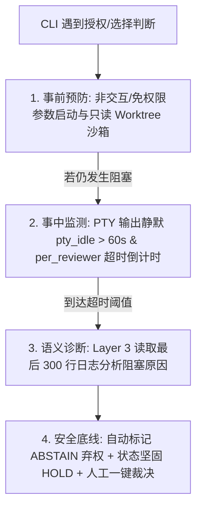

# MACAO 常见问题与架构设计指南 (FAQ)

本文档汇总了关于 **MACAO (Multi-Agent CLI Agent Orchestrator)** 的核心使用方式、架构哲学、多 Agent 交互模式、运行时机制及既有项目接入的常见问题解答。

---

## 目录

- [一、快速上手与实机体验](#一快速上手与实机体验)
  - [Q1: 目前有最小（2~3 个真实 CLI）流程可以走通体验吗？](#q1-目前有最小23-个真实-cli流程可以走通体验吗)
  - [Q2: 如何获取当前各个真实 AI CLI 的状态？](#q2-如何获取当前各个真实-ai-cli-的状态)
- [二、CLI 运行模式与适配器架构](#二cli-运行模式与适配器架构)
  - [Q3: CLI 是运行在批处理模式还是交互式模式？需要安装插件/Hook 吗？](#q3-cli-是运行在批处理模式还是交互式模式需要安装插件hook-吗)
  - [Q4: PTY-Wrapper 模式下遇到权限授权、多选判断等情况如何处理？](#q4-pty-wrapper-模式下遇到权限授权多选判断等情况如何处理)
  - [Q5: 编排器 MACAO 本身接入了哪个大模型？](#q5-编排器-macao-本身接入了哪个大模型)
- [三、团队角色与模型细粒度控制](#三团队角色与模型细粒度控制)
  - [Q6: 如何自由配置执行者/审查者角色，并控制各 CLI 具体使用的模型（如 GLM 5.3 max / Qwen3.8 max）？](#q6-如何自由配置执行者审查者角色并控制各-cli-具体使用的模型如-glm-53-max--qwen38-max)
  - [Q7: 编排者 MACAO 本身是一个 CLI 式的交互界面吗？](#q7-编排者-macao-本身是一个-cli-式的交互界面吗)
- [四、既有项目接入与架构哲学](#四既有项目接入与架构哲学)
  - [Q8: 如何将 MACAO 接入到一个已经存在的既有项目中？](#q8-如何将-macao-接入到一个已经存在的既有项目中)
  - [Q9: 为什么配置文件没有记录 CLI 状态和 Worktree？AI 助手如何协助？](#q9-为什么配置文件没有记录-cli-状态和-worktreeai-助手如何协助)
  - [Q10: 编排者为什么要感知开发环境？关注点分离与极简边界是什么？](#q10-编排者为什么要感知开发环境关注点分离与极简边界是什么)
  - [Q11: 关于 agmsg 通信总线、CLI 实时运行态探活、既有项目规范化与 Git Worktree 机制](#q11-关于-agmsg-通信总线cli-实时运行态探活既有项目规范化与-git-worktree-机制)

---

## 一、快速上手与实机体验

### Q1: 目前有最小（2~3 个真实 CLI）流程可以走通体验吗？

**答**：是的，当前环境已预装 **Claude Code、Codex CLI、OpenCode、Google Antigravity (agy)、Cursor Agent (agent)、Kimi** 等真实 CLI，并提供三种层次的体验方式：

1. **真实环境探活与 PTY 沙箱冒烟（已内置）**：
   ```bash
   # 1. 探活检测 6 款真实 CLI、Git 与 SQLite WAL 状态
   PYTHONPATH=src python3 -m macao.cli.main preflight

   # 2. 真实唤起各 CLI 的 PTY 伪终端会话（验证 ANSI 清洗与 0 僵尸进程回收）
   PYTHONPATH=src python3 -m macao.cli.main test-clis
   ```
2. **全流程 7 步微任务端到端闭环（一键运行）**：
   ```bash
   # 体验从任务创建 -> Checkpoint 门禁 -> Worktree 派发 -> 3方评审 -> Fast-Forward 合并 -> 产物归档
   PYTHONPATH=src python3 -m macao.cli.main live-run
   ```
3. **真实多 Agent 协作实操分步流程**：
   - 初始化配置：`macao init`
   - 创建任务：`macao task create --title "实现某功能" --branch "feature/my-task"`
   - 执行者（如 OpenCode / Claude Code）编写代码并生成 `.macao/.dev.yml`；
   - 协调器自动在 `.macao/worktrees/` 创建隔离工作区并派发审查；
   - 审查者（如 Codex、Cursor Agent、Antigravity）生成 `.review.yml`；
   - 协调器完成 2/3 多数共识裁决并自动 Fast-Forward 合入主分支。

---

### Q2: 如何获取当前各个真实 AI CLI 的状态？

**答**：MACAO 提供了 3 种命令行看板和一套 Python 编程式 API：

1. **静态预检状态（安装、路径、版本、执行模式）**：
   ```bash
   PYTHONPATH=src python3 -m macao.cli.main preflight
   ```
2. **动态 PTY 会话与进程健康状态（会话拉起、ANSI 过滤、0 僵尸检测、延迟）**：
   ```bash
   PYTHONPATH=src python3 -m macao.cli.main test-clis
   # 或单独测试指定 CLI
   PYTHONPATH=src python3 -m macao.cli.main test-clis --cli cursor
   ```
3. **编排中实时任务与审查状态看板**：
   ```bash
   PYTHONPATH=src python3 -m macao.cli.main status
   ```
4. **Python API 编程式获取**：
   ```python
   from macao.adapter.opencode import OpenCodeAdapter
   adp = OpenCodeAdapter()
   print("Preflight:", adp.preflight())
   print("Is Running:", adp.is_running)
   ```

---

## 二、CLI 运行模式与适配器架构

### Q3: CLI 是运行在批处理模式还是交互式模式？需要安装插件/Hook 吗？

**答**：**完全不需要为 CLI 安装任何定制的 Hook、Plugin 或魔改扩展。**

MACAO 采用 **PTY-Wrapper（伪终端封装模式）**：
* **工作原理**：使用 Python `pty.openpty()` 为子进程分配虚拟终端，携带非交互/免确认参数（如 `--quiet`, `-p`, `--dangerously-skip-permissions`）启动原生 CLI。
* **零侵入优势**：只要系统 `PATH` 中安装了原版 CLI，MACAO 开箱即用。
* **输出自愈保障**：即使 LLM 输出夹带客套话或 Markdown 代码栅栏，MACAO 内置 **两级自愈机制（Two-Level Self-Healing）**：
  1. *Extractor 正则提取*：自动剥离 ANSI 颜色码与客套话，提取纯净 YAML；
  2. *Draft-07 Schema 先验校验与上下文对齐*，确保落盘产物 100% 格式合规。


---

### Q4: PTY-Wrapper 模式下遇到权限授权、多选判断等情况如何处理？

**答**：MACAO 建立了 **“事前预防 $\rightarrow$ 事中静默探测 $\rightarrow$ 事后安全接管”** 的四道防御机制：



* **安全底线原则**：MACAO **绝不在后台盲目发送 `y` 或回车**（防止执行破坏性命令）；
* **超时自动处置**：到达超时时间后自动记入 `ABSTAIN`（弃权票），状态进入 `CONSENSUS_CHECK` (HOLD) 并通知人类；
* **人工一键放行**：开发者通过 `macao override resolve --choice APPROVED` 即可一键恢复。

---

### Q5: 编排器 MACAO 本身接入了哪个大模型？

**答**：**MACAO 核心编排器本身不依赖任何大模型，它是一个 100% 确定性的代码引擎！**

* **确定性核心（Deterministic Core）**：状态机推进（FSM）、Schema 校验、2/3 多数票算术、Git Fast-Forward 合并与不可变审计账本**全由 Python 纯代码驱动（0% LLM 依赖）**，彻底避免大模型幻觉带来的误合并风险。
* **智能化边缘（Agentic Edge）**：真正编写代码与审查代码的大模型，完全由被调度的各个 Agent CLI 自行携带：
  * Claude Code $\rightarrow$ Claude 3.5 / 3.7 Sonnet
  * Codex CLI $\rightarrow$ OpenAI o1 / o3 / GPT-4o
  * Google Antigravity (agy) $\rightarrow$ Gemini 2.0 Pro / Flash
  * OpenCode $\rightarrow$ DeepSeek-V3/R1 / Qwen 2.5-Coder / GLM
  * Cursor Agent (agent) $\rightarrow$ Claude 3.5 Sonnet / GPT-4o
  * Kimi Code $\rightarrow$ Kimi K1.5 / K2
* **可选 Layer 3 诊断层**：仅在死锁或异常排错时，可配置任意轻量模型读取最后 300 行日志生成人类可读报告。

---

## 三、团队角色与模型细粒度控制

### Q6: 如何自由配置执行者/审查者角色，并控制各 CLI 具体使用的模型（如 GLM 5.3 max / Qwen3.8 max）？

**答**：直接在项目根目录的 `macao.yaml` 中为每个角色声明 `cli` 与 `model` 字段：

```yaml
# macao.yaml - 多 Agent 编排配置
project:
  name: "macao-demo"
  repository:
    workspace_path: "."
    remote_name: "origin"
    default_branch: "main"

team:
  # 1. 设置 OpenCode 为执行者，指定模型为 GLM 5.3 max
  executor:
    id: "opencode-dev"
    cli: "opencode"
    adapter: "pty-wrapper"
    model: "GLM 5.3 max"       # 启动时自动透传 -m "GLM 5.3 max"

  # 2. 设置多元审查团，分别指定不同模型
  reviewers:
    # 审查者 1: OpenCode 使用 Qwen3.8 max
    - id: "opencode-rev"
      cli: "opencode"
      adapter: "pty-wrapper"
      model: "Qwen3.8 max"      # 启动时自动透传 -m "Qwen3.8 max"

    # 审查者 2: Cursor Agent (agent)
    - id: "cursor-rev"
      cli: "agent"
      adapter: "pty-wrapper"
      model: "claude-3-5-sonnet"# 启动时自动透传 --model claude-3-5-sonnet

    # 审查者 3: Google Antigravity
    - id: "agy-rev"
      cli: "agy"
      adapter: "pty-wrapper"
      model: "gemini-2.0-pro"   # 启动时自动透传 --model gemini-2.0-pro
```

---

### Q7: 编排者 MACAO 本身是一个 CLI 式的交互界面吗？

**答**：是的，MACAO 是一个标准的**命令驱动型 CLI（Command-Driven CLI）**，类似于 `git`、`docker` 或 `kubectl`：
* **前台体验**：开发者在终端使用 `macao task create`、`macao status`、`macao override resolve` 等指令，界面使用 Rich 渲染清晰的彩色表格与状态看板，无全屏阻塞；
* **后台调度**：被编排的各个 Agent CLI 在后台无头 PTY 伪终端沙箱中静默运行，日志集中归档到 SQLite 数据库与 `.macao/` 中。

---

## 四、既有项目接入与架构哲学

### Q8: 如何将 MACAO 接入到一个已经存在的既有项目中？

**答**：遵循 **零侵入（Zero Intrusion）** 原则，无需修改业务代码，只需 4 步：

1. **生成配置**：在项目根目录运行 `macao init` 生成 `macao.yaml`，按需配置团队成员与可选测试门禁（如 `ci_gate_command: "pytest -q"` 或 `npm test`）；
2. **隔离运行时**：在现有项目的 `.gitignore` 中追加：
   ```gitignore
   .macao/worktrees/
   .macao/*.db
   ```
3. **环境自检**：运行 `macao doctor` 与 `macao preflight`；
4. **发起任务**：运行 `macao task create --title "需求描述" --branch "feature/xxx"` 开始协同。

---

### Q9: 为什么配置文件没有记录 CLI 状态和 Worktree？AI 助手如何协助？

**答**：这是**“静态期望配置”**与**“动态运行时状态”**解耦的设计哲学：

1. **`macao.yaml` 是静态规范（Specification）**：定义团队角色、使用模型、超时和共识比例，随 Git 版本管理，必须保持干净稳定；
2. **动态运行时状态存放在 `.macao/state.db` (SQLite WAL)**：记录当前任务 FSM 状态、动态分配的 Git Worktree 路径、产物哈希与各 Reviewer 的实时阶段；
3. **AI 助手的职责定位**：
   * *只读诊断*：实时读取 SQLite 状态与日志，用自然语言回答“哪个 Agent 卡住了”、“Worktree 在哪”；
   * *受控状态更新*：通过调用安全状态机 API（如 `resolve_override`、`reconcile`）更新数据库，绝不直接执行裸 SQL，确保状态机门禁不被绕过。

---

### Q10: 编排者为什么要感知开发环境？关注点分离与极简边界是什么？

**答**：**编排者核心不做事无巨细的“语言构建工具”，而是纯粹中立的“流程裁判与调度路由器”**。

* **业务技术栈与构建测试**：属于**执行者（Executor）与被管项目**自身的事，执行者自测并在 `.dev.yml` 中声明；
* **编排者最小不可或缺的感知仅有 2 件事**：
  1. *Git 仓库与分支信息*（作为代码事实源与隔离 Worktree 载体）；
  2. *团队成员通信拓扑*（确定将指令与 Diff 派发给谁）。

---

### Q11: 关于 agmsg 通信总线、CLI 实时运行态探活、既有项目规范化与 Git Worktree 机制

**答**：

1. **`agmsg` 消息总线定位**：
   - 进程内采用 Python `MessageBus` 进行 AEP 信封封装与 ACK 追踪；进程间支持探活并调用独立的 `agmsg` 命令行/MCP 消息总线。
2. **CLI 实时运行态探活（Live Health Probe）**：
   - 不仅检测“是否安装”，还在任务派发前探活“会话是否被外部终端占用（Session Lock）”、“API Token 是否有效”与“PTY 响应延迟”。
3. **既有项目规范化三大抓手**：
   - *分支保护*：主干 `main` 设为只读，仅 MACAO Merge Controller 在达成 2/3 共识后有权 Fast-Forward 合入；
   - *显式产物入口*：开发完成以 `.macao/.dev.yml` 提交作为触发评审的唯一信号；
   - *提示词规则注入*：在项目内注入 `.macao/AGENT_RULES.md`（或 `CLAUDE.md` / `.cursorrules`），让 Agent 默认遵守状态机规范。
4. **Git Worktree 全生命周期机制**：
   - *探测与修剪*：启动前 `git worktree prune` 抹除孤儿映射；
   - *动态挂载*：评审开始时自动为每位审查者在 `.macao/worktrees/<task_id>/<reviewer_id>` 挂载独立分支；
   - *原子清理*：评审结束或任务完成自动 `git worktree remove --force`，做到零磁盘残留。
