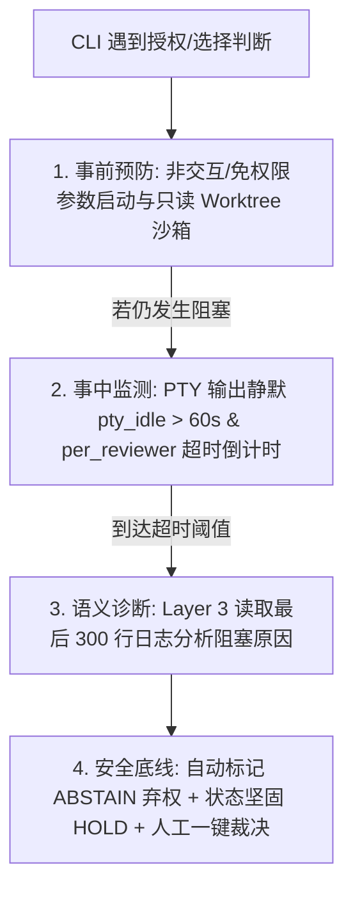

# MACAO 常见问题与架构设计指南 (FAQ)

本文档汇总了关于 **MACAO (Multi-Agent CLI Agent Orchestrator)** 的核心使用方式、架构哲学、多 Agent 交互模式、运行时机制及既有项目接入的常见问题解答。

---

## 目录

- [一、快速上手与实机体验](#一快速上手与实机体验)
  - [Q1: 目前有最小（2~3 个真实 CLI）流程可以走通体验吗？](#q1-目前有最小23-个真实-cli流程可以走通体验吗)
  - [Q2: 如何获取当前各个真实 AI CLI 的状态？](#q2-如何获取当前各个真实-ai-cli-的状态)
- [二、CLI 运行模式与适配器架构](#二cli-运行模式与适配器架构)
  - [Q3: CLI 是运行在批处理模式还是交互式模式？需要安装插件/Hook 吗？](#q3-cli-是运行在批处理模式还是交互式模式需要安装插件hook-吗)
  - [Q4: PTY-Wrapper 模式下遇到权限授权、多选判断等情况如何处理？](#q4-pty-wrapper-模式下遇到权限授权多选判断等情况如何处理)
  - [Q5: 编排器 MACAO 本身接入了哪个大模型？](#q5-编排器-macao-本身接入了哪个大模型)
- [三、团队角色与模型细粒度控制](#三团队角色与模型细粒度控制)
  - [Q6: 如何自由配置执行者/审查者角色，并控制各 CLI 具体使用的模型（如 GLM 5.3 max / Qwen3.8 max）？](#q6-如何自由配置执行者审查者角色并控制各-cli-具体使用的模型如-glm-53-max--qwen38-max)
  - [Q7: 编排者 MACAO 本身是一个 CLI 式的交互界面吗？](#q7-编排者-macao-本身是一个-cli-式的交互界面吗)
- [四、既有项目接入与架构哲学](#四既有项目接入与架构哲学)
  - [Q8: 如何将 MACAO 接入到一个已经存在的既有项目中？](#q8-如何将-macao-接入到一个已经存在的既有项目中)
  - [Q9: 为什么配置文件没有记录 CLI 状态和 Worktree？AI 助手如何协助？](#q9-为什么配置文件没有记录-cli-状态和-worktreeai-助手如何协助)
  - [Q10: 编排者为什么要感知开发环境？关注点分离与极简边界是什么？](#q10-编排者为什么要感知开发环境关注点分离与极简边界是什么)
  - [Q11: 关于 agmsg 通信总线、CLI 实时运行态探活、既有项目规范化与 Git Worktree 机制](#q11-关于-agmsg-通信总线cli-实时运行态探活既有项目规范化与-git-worktree-机制)
- [五、状态机、产物分层与共识](#五状态机产物分层与共识)
  - [Q12: 如何判断该通知 Reviewer 还是该等 Executor？角色状态和项目状态是一回事吗？](#q12-如何判断该通知-reviewer-还是该等-executor角色状态和项目状态是一回事吗)
  - [Q13: 编排器会不会规划任务、写评审申请、筛选哪些意见可采纳？](#q13-编排器会不会规划任务写评审申请筛选哪些意见可采纳)
  - [Q14: agmsg、`.dev.yml` / `.review.yml` 和 `docs/reviews/` 各放什么？](#q14-agmsgdevyml--reviewyml-和-docsreviews-各放什么)
  - [Q15: `vote_result.json` 要不要收录各模型的修改意见？计票如何加权？](#q15-vote_resultjson-要不要收录各模型的修改意见计票如何加权)
  - [Q16: 评审方法、留痕和人工接管分别在哪？](#q16-评审方法留痕和人工接管分别在哪)
- [六、用例目录](#六用例目录)

---

## 一、快速上手与实机体验

### Q1: 目前有最小（2~3 个真实 CLI）流程可以走通体验吗？

**答**：是的，当前环境已预装 **Claude Code、Codex CLI、OpenCode、Google Antigravity (agy)、Cursor Agent (agent)、Kimi** 等真实 CLI，并提供三种层次的体验方式：

1. **真实环境探活与 PTY 沙箱冒烟（已内置）**：
   ```bash
   # 1. 探活检测 6 款真实 CLI、Git 与 SQLite WAL 状态
   PYTHONPATH=src python3 -m macao.cli.main preflight

   # 2. 真实唤起各 CLI 的 PTY 伪终端会话（验证 ANSI 清洗与 0 僵尸进程回收）
   PYTHONPATH=src python3 -m macao.cli.main test-clis
   ```
2. **全流程 7 步微任务端到端闭环（一键运行）**：
   ```bash
   # 体验从任务创建 -> Checkpoint 门禁 -> Worktree 派发 -> 3方评审 -> Fast-Forward 合并 -> 产物归档
   PYTHONPATH=src python3 -m macao.cli.main live-run
   ```
3. **真实多 Agent 协作实操分步流程**：
   - 初始化配置：`macao init`
   - 创建任务：`macao task create --title "实现某功能" --branch "feature/my-task"`
   - 执行者（如 OpenCode / Claude Code）编写代码并生成 `.macao/.dev.yml`；
   - 协调器自动在 `.macao/worktrees/` 创建隔离工作区并派发审查；
   - 审查者（如 Codex、Cursor Agent、Antigravity）生成 `.review.yml`（摘要）与 `docs/reviews/` 全文；
   - 编排器按加权决策表**计票**（不读评审正文），`APPROVED` 后走 Fast-Forward 合入；意见是否采纳由执行者在返工中筛选。

---

### Q2: 如何获取当前各个真实 AI CLI 的状态？

**答**：MACAO 提供了 3 种命令行看板和一套 Python 编程式 API：

1. **静态预检状态（安装、路径、版本、执行模式）**：
   ```bash
   PYTHONPATH=src python3 -m macao.cli.main preflight
   ```
2. **动态 PTY 会话与进程健康状态（会话拉起、ANSI 过滤、0 僵尸检测、延迟）**：
   ```bash
   PYTHONPATH=src python3 -m macao.cli.main test-clis
   # 或单独测试指定 CLI
   PYTHONPATH=src python3 -m macao.cli.main test-clis --cli cursor
   ```
3. **编排中实时任务与审查状态看板**：
   ```bash
   PYTHONPATH=src python3 -m macao.cli.main status
   ```
4. **Python API 编程式获取**：
   ```python
   from macao.adapter.opencode import OpenCodeAdapter
   adp = OpenCodeAdapter()
   print("Preflight:", adp.preflight())
   print("Is Running:", adp.is_running)
   ```

---

## 二、CLI 运行模式与适配器架构

### Q3: CLI 是运行在批处理模式还是交互式模式？需要安装插件/Hook 吗？

**答**：**完全不需要为 CLI 安装任何定制的 Hook、Plugin 或魔改扩展。**

MACAO 采用 **PTY-Wrapper（伪终端封装模式）**：
* **工作原理**：使用 Python `pty.openpty()` 为子进程分配虚拟终端，携带非交互/免确认参数（如 `--quiet`, `-p`, `--dangerously-skip-permissions`）启动原生 CLI。
* **零侵入优势**：只要系统 `PATH` 中安装了原版 CLI，MACAO 开箱即用。
* **输出自愈保障**：即使 LLM 输出夹带客套话或 Markdown 代码栅栏，MACAO 内置 **两级自愈机制（Two-Level Self-Healing）**：
  1. *Extractor 正则提取*：自动剥离 ANSI 颜色码与客套话，提取纯净 YAML；
  2. *Draft-07 Schema 先验校验与上下文对齐*，确保落盘产物 100% 格式合规。


---

### Q4: PTY-Wrapper 模式下遇到权限授权、多选判断等情况如何处理？

**答**：MACAO 建立了 **“事前预防 $\rightarrow$ 事中静默探测 $\rightarrow$ 事后安全接管”** 的四道防御机制：



* **安全底线原则**：MACAO **绝不在后台盲目发送 `y` 或回车**（防止执行破坏性命令）；
* **超时自动处置**：到达超时时间后自动记入 `ABSTAIN`（弃权票），状态进入 `CONSENSUS_CHECK` (HOLD) 并通知人类；
* **人工一键放行**：开发者通过 `macao override resolve --choice APPROVED` 即可一键恢复。

---

### Q5: 编排器 MACAO 本身接入了哪个大模型？

**答**：**MACAO 核心编排器本身不依赖任何大模型，它是一个 100% 确定性的规则引擎（流程裁判 + 邮差）。**

* **确定性核心**：FSM 推进、Schema / sha256 校验、加权 2/3 计票、Git Fast-Forward、审计账本全由 Python 驱动（0% LLM），避免幻觉导致误合并。
* **不介入项目内容**：不拆解需求、不撰写评审申请或结论、不归纳「相同问题」、不决定哪条意见可采纳。即使将来可选接入模型，也只用于 Layer 3 排障报告，不得驱动业务态。
* **智能化边缘**：写代码与写评审全文的模型，只存在于被调度的 Agent CLI（执行者 / 评审专家）上。
* **可选 Layer 3**：仅死锁或 PTY 卡死时，可配置轻量模型读最后 300 行日志生成**给管理员看**的报告，不自动改 FSM。

---

## 三、团队角色与模型细粒度控制

### Q6: 如何自由配置执行者/审查者角色，并控制各 CLI 具体使用的模型（如 GLM 5.3 max / Qwen3.8 max）？

**答**：直接在项目根目录的 `macao.yaml` 中为每个角色声明 `cli` 与 `model` 字段：

```yaml
# macao.yaml - 多 Agent 编排配置
project:
  name: "macao-demo"
  repository:
    workspace_path: "."
    remote_name: "origin"
    default_branch: "main"

team:
  # 1. 设置 OpenCode 为执行者，指定模型为 GLM 5.3 max
  executor:
    id: "opencode-dev"
    cli: "opencode"
    adapter: "pty-wrapper"
    model: "GLM 5.3 max"       # 启动时自动透传 -m "GLM 5.3 max"

  # 2. 设置多元审查团，分别指定不同模型
  reviewers:
    # 审查者 1: OpenCode 使用 Qwen3.8 max
    - id: "opencode-rev"
      cli: "opencode"
      adapter: "pty-wrapper"
      model: "Qwen3.8 max"      # 启动时自动透传 -m "Qwen3.8 max"

    # 审查者 2: Cursor Agent (agent)
    - id: "cursor-rev"
      cli: "agent"
      adapter: "pty-wrapper"
      model: "claude-3-5-sonnet"# 启动时自动透传 --model claude-3-5-sonnet

    # 审查者 3: Google Antigravity；vote_weight 为管理员写死的计票权重（默认 1，禁止按文笔自动加权）
    - id: "agy-rev"
      cli: "agy"
      adapter: "pty-wrapper"
      model: "gemini-2.0-pro"
      vote_weight: 1
```

---

### Q7: 编排者 MACAO 本身是一个 CLI 式的交互界面吗？

**答**：是的，MACAO 是一个标准的**命令驱动型 CLI（Command-Driven CLI）**，类似于 `git`、`docker` 或 `kubectl`：
* **前台体验**：开发者在终端使用 `macao task create`、`macao status`、`macao override resolve` 等指令，界面使用 Rich 渲染清晰的彩色表格与状态看板，无全屏阻塞；
* **后台调度**：被编排的各个 Agent CLI 在后台无头 PTY 伪终端沙箱中静默运行，日志集中归档到 SQLite 数据库与 `.macao/` 中。

---

## 四、既有项目接入与架构哲学

### Q8: 如何将 MACAO 接入到一个已经存在的既有项目中？

**答**：遵循 **零侵入（Zero Intrusion）** 原则，无需修改业务代码，只需 4 步：

1. **生成配置**：在项目根目录运行 `macao init` 生成 `macao.yaml`，按需配置团队成员与可选测试门禁（如 `ci_gate_command: "pytest -q"` 或 `npm test`）；
2. **隔离运行时**：在现有项目的 `.gitignore` 中追加：
   ```gitignore
   .macao/worktrees/
   .macao/*.db
   ```
3. **环境自检**：运行 `macao doctor` 与 `macao preflight`；
4. **发起任务**：运行 `macao task create --title "需求描述" --branch "feature/xxx"` 开始协同。

---

### Q9: 为什么配置文件没有记录 CLI 状态和 Worktree？AI 助手如何协助？

**答**：这是**“静态期望配置”**与**“动态运行时状态”**解耦，再叠加**任务 FSM 单一事实源**：

1. **`macao.yaml` 是静态规范**：团队角色、模型、`vote_weight`、超时和共识比例，随 Git 管理。
2. **`.macao/state.db` 是动态运行时**：任务 FSM、Worktree 路径、产物哈希、席位投影快照。不进 Git（由 `macao init` / `setup` 写入 `.gitignore`）。
3. **项目态 ≠ 每人一套 FSM**：库里只有一个 `tasks.state`（10 态）。各角色的「状态」是该任务态上的投影（例如任务 `WAITING_REVIEW` 时，未交票的专家是「该评」，执行者是「等票」）。详见 [Q12](#q12-如何判断该通知-reviewer-还是该等-executor角色状态和项目状态是一回事吗)。
4. **AI 助手**：只读诊断 SQLite / 日志；改状态必须走 `resolve_override`、`reconcile` 等门禁 API，禁止裸 SQL。`macao init` 识别不出唯一态时**问管理员**，不猜、不让执行者自裁。

---

### Q10: 编排者为什么要感知开发环境？关注点分离与极简边界是什么？

**答**：**编排者是无模型的流程裁判 + 邮差，不是开发者。** 最小感知只有：① Git 仓库与分支；② 团队通信拓扑（把信封投给谁）。

| 动作 | 内容写者（接模型的 CLI） | 编排器（规则） |
|---|---|---|
| 开任务 | **管理员或执行者** `macao task create`（标题/验收/分支） | 收表单、建任务行、发 `DEVELOPMENT_STARTED` 信封 |
| 评审申请 | **执行者** 写全文 + `.dev.yml` 摘要 | 校验 manifest，原样投递 `REVIEW_REQUEST` |
| 评审结论 | **各专家** 写全文 + `.review.yml` 摘要与总票 | 校验、催票、收票 |
| 是否合入 | —（无内容作者） | 按加权决策表写 `vote_result.decision` |
| 哪些意见采纳 | **执行者** 读全文后写采纳清单 | 只检查清单是否按 Schema 出现 |
| 僵局 | **管理员** `override resolve` | 不把自裁权交给执行者 |

禁止编排器：拆 WBS、写/改申请或结论、语义合并「相同问题」、按字数给模型加权。详见 [Q13](#q13-编排器会不会规划任务写评审申请筛选哪些意见可采纳)。

---

### Q11: 关于 agmsg 通信总线、CLI 实时运行态探活、既有项目规范化与 Git Worktree 机制

**答**：

1. **`agmsg`：通知通道，不是事实源、不是全文库**
   - 正文有体积上限，只适合 ping：谁行动、短 SHA、manifest 路径、全文路径。
   - **不是** FSM 事实源，**不是**评审结论，**不是** L1–L4 留痕。只经官方脚本（`team.sh` / `history.sh` / `identities.sh` / `whoami.sh` / `join.sh` / `send.sh`）；禁止直读 `db/`、`teams/`、`run/actas.*`；探活不用会 mark-read 的 `inbox.sh`。
2. **CLI 实时运行态探活**：派发前探安装、会话锁、Token、PTY 延迟。探活失败不得用默认版本冒充。
3. **既有项目规范化**：主干只读 + Merge Controller 在共识后 Fast-Forward；显式产物入口为 `.dev.yml`（摘要）+ `docs/reviews/`（全文）；提示词规则可注入 `.macao/AGENT_RULES.md`。
4. **Git Worktree**：`prune` → 按 `.macao/worktrees/<reviewer>/<task>/r<round>` 挂载 → 结束后 `remove --force`。

---

## 五、状态机、产物分层与共识

### Q12: 如何判断该通知 Reviewer 还是该等 Executor？角色状态和项目状态是一回事吗？

**答**：看**任务级 FSM**（单一事实源），不要给每个 CLI 各存一套 10 态。`READING_MSG`、把 `REVIEWING` 升成项目态、把专家标成 `DONE`，都会让编排器再次无法判断该等谁。

| 项目态 | 执行者该做什么 | 评审专家该做什么 | 编排器只做 |
|---|---|---|---|
| `IDLE` / `DONE` / `CANCELLED` | 等新任务（人或执行者去 `task create`） | 等新任务 | 提示，不规划 WBS |
| `CODING` / `REWORK` | 编码；返工时读意见并筛选采纳 | 等派发 | ping 执行者 |
| `READY_FOR_REVIEW` | 检查点已交（申请=已写的 `.dev.yml` + 全文） | 仍未派发 | 校验信封并 ping 专家（不改摘要） |
| `WAITING_REVIEW` | 等票 | 未交：**该评**（席位视图 `REVIEWING`）；已交：已交票 | 催未交席位；不读全文 |
| `CONSENSUS_CHECK` | 等计票结果 | 等计票结果 | 加权决策表；僵局问管理员 |
| `MERGING` | 等合并流水线 | 等合并结束 | CI / 签字 / push（合的是 git，不是「合并意见」） |

`REVIEWING` 只是专家在 `WAITING_REVIEW` 下的局部视图（PRD §1.2），**不是**第十一个任务态。读 agmsg 是 ping 一瞬，不单列为角色态。

`macao init` 能唯一推出上表则不问人；库态与产物打架、自报互斥、只有可疑信号时**问管理员**（`--yes` 禁止代选）。

### Q13: 编排器会不会规划任务、写评审申请、筛选哪些意见可采纳？

**答**：不会。这三件都需要理解项目内容，规则机做不了，也不该做。见 [Q5](#q5-编排器-macao-本身接入了哪个大模型) 与 [Q10](#q10-编排者为什么要感知开发环境关注点分离与极简边界是什么)。

- `task create` 的标题/验收由**管理员或执行者**填写。
- 评审申请正文由**执行者**写在 `docs/reviews/`，`.dev.yml` 只是摘要信封；`REVIEW_REQUEST` 是邮差。
- `vote_result.decision` 是计票；**采纳哪些修改意见**由执行者另写清单。执行者不能写 `decision`（被评人兼裁判）。

### Q14: agmsg、`.dev.yml` / `.review.yml` 和 `docs/reviews/` 各放什么？

**答**：agmsg 有体积上限，这正是 `docs/reviews/` 存在的原因。

| 层 | 放什么 |
|---|---|
| agmsg 正文 | ping：谁行动、短 SHA、yml 路径、全文路径 |
| `.macao/.dev.yml` / `.macao/.reviews/<id>.review.yml` | 信封：status/vote、短摘要、问题索引（id/severity/一行）、`full_document.path` + `sha256` |
| `docs/reviews/*.md` | 评审申请 / 评审结论**全文**（命名见 `docs/MACAO_REVIEW_GUIDELINES.md` §1.3） |

编排器只核 yml Schema 与 sha256 是否对得上文件字节，不解析 markdown。对不上 → 该票无效。

### Q15: `vote_result.json` 要不要收录各模型的修改意见？计票如何加权？

**答**：要**问题目录**，不要正文，不要编排器做语义去重，不要在此文件里标「采纳」。

一份结论 = 一张总票 + 若干问题点。不同模型的问题默认是不同条目（`id` 带 `reviewer_id` 前缀）。`vote_result` 三段：

1. **计票**：各席位 vote、`vote_weight`、加权合计、`decision`（编排器算）
2. **`issues_index`**：从各 `.review.yml` **原样复制**索引（搬运，不改写）
3. **采纳**：执行者另写，用 `id` 引用目录

权重解决「细致程度不同、一票一刀切太粗」，但必须是 `macao.yaml` 里管理员写死的 `vote_weight`（默认 1）。禁止按字数/问题条数自动加权。

加权仍是确定性函数：有效权重 = 未弃权席位权重之和；赞成或反对加权占比 ≥ 2/3 才出 `APPROVED` / `REWORK_REQUIRED`，否则问管理员。另有两道闸：**席位法定人数** `⌈2N/3⌉` 仍保留；**独裁帽**——任一席位权重 / 总权重必须 &lt; 2/3，否则拒绝启动。权重只作用在总票上，单条改不改仍是执行者的内容工作。

现 Schema 中由编排器填写的 `next_step.issues_to_fix` 正文应废止（实现前须回写 PRD / Schema）。

### Q16: 评审方法、留痕和人工接管分别在哪？

**答**：

* **方法**：`docs/MACAO_REVIEW_GUIDELINES.md` 为准，`docs/reference/*.md` 为方法来源。
* **留痕**：`docs/reviews/<yyyy-MM-dd>-review-request-*.md` 与 `docs/reviews/<yyyy-MM-dd>-review-result-<mid>-<reviewer>.md`；门禁只改 `docs/reviews/STATUS.md`。禁止把 L1–L4 结论只写在 agmsg 里。
* **init 歧义**：问管理员（向导在场）。
* **运行期僵局**：`macao override resolve`，不是执行者自裁。

---

## 六、用例目录

总体用例索引见 [`docs/usercases/README.md`](usercases/README.md)（与 PRD §14 主旅程对齐）。当前已成稿的是 **UC-1 初始化**（[`UC1-init-glm.md`](usercases/UC1-init-glm.md) 为设计主稿）。
