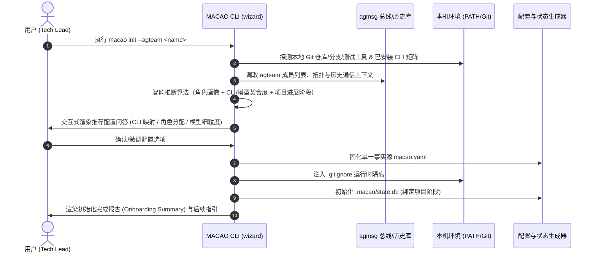

# 用例规格说明书：MACAO 项目智能初始化 (UC-INIT-01)

> **文档标识**：`docs/usecases/UC1-init-gemini.md`
> **版本**：v1.0 (2026-08-31)
> **状态**：Draft / Specification
> **适用范围**：MACAO CLI (`macao init` / `macao setup`)、`wizard.py` 智能向导模块、`agmsg` 团队感知与拓扑映射模块

---

## 1. 基本信息 (Metadata)

* **用例标识 (ID)**：`UC-INIT-01`
* **用例名称**：基于 `agmsg` 团队拓扑与本地 CLI 画像的项目智能初始化 (`macao init`)
* **主要参与者 (Primary Actor)**：项目负责人 / 开发者 (Developer / Tech Lead)
* **次要参与者 (Secondary Actor)**：`agmsg` 消息总线守护进程、本地 AI CLI 矩阵（OpenCode / Claude Code / Codex / AGY 等）、MACAO 核心编排引擎
* **触发条件 (Trigger)**：用户在项目根目录下执行 `macao init [--agteam <team_name>]`
* **前置条件 (Pre-conditions)**：
  1. 当前目录为合法目录（推荐包含或即将初始化 Git 仓库）；
  2. （可选）宿主环境中已安装并配置 `agmsg`，包含团队定义与历史通道记录；
  3. 宿主环境中已安装至少 1 款可用的 AI CLI。
* **后置条件 (Post-conditions)**：
  1. 在项目根目录生成符合 Draft-07 Schema 的单一事实源配置文件 `macao.yaml`；
  2. 项目的 `.gitignore` 自动注入运行时隔离规则（`.macao/worktrees/`, `.macao/.reviews/`, `*.db*` 等）；
  3. 初始化本地 SQLite 状态存储 `.macao/state.db`，若为存量在建项目则挂载识别到的任务进度。

---

## 2. 核心主业务流程 (Main Success Scenario)



---

## 3. 详细步骤描述 (Detailed Steps)

### 步骤 1：命令触发与参数预检
1. 用户进入目标项目目录 `~/projectX`，输入初始化命令：
   ```bash
   macao init --agteam stockdb
   ```
2. MACAO 向导检查当前工作区，读取参数 `--agteam stockdb`。
3. 若用户未显式传参但环境中检测到 `agmsg`，向导将列出当前可用的 teams 供用户单选。

### 步骤 2：双轨智能探活 (Dual-Track Auto-Discovery)
1. **轨道 A - `agmsg` 团队拓扑与历史通信感知**：
   * 读取 `agmsg` 配置，获取 `stockdb` 团队元数据（成员 ID、成员别名、通信 Topic/Address）；
   * 调取该 team 的历史通信记录（最近消息记录、历史派发、指令流），提取文本语义特征。
2. **轨道 B - 宿主开发环境感知**：
   * **CLI 探活**：扫描 `PATH` 探测已安装的 CLI（如 `opencode`, `claude-code`, `codex`, `agy`, `cursor`/`agent` 等）及其底层可用模型与版本；
   * **Git 上下文**：探测当前仓库默认分支（`main`/`master`）、远端源名称（`origin`）；
   * **测试套件推断**：检查项目文件特征（`pytest.ini`/`package.json`/`Cargo.toml`/`go.mod`）推断 CI 门禁命令。

### 步骤 3：智能推断与画像生成 (AI Role & Status Inference)
1. **角色画像推断 (Role Inference)**：
   * 分析 `agmsg` 历史通信中的发言模式：
     * 频繁发出指令、提交代码、回复实现细节的成员 $\rightarrow$ 推断为 **Executor (执行者 / 研发主力)**；
     * 频繁指出问题、提出审查反馈、核对合规指标的成员 $\rightarrow$ 推断为 **Reviewer (审查者 / 架构安全质检)**。
2. **CLI 矩阵与团队成员契合度匹配 (CLI-to-Member Mapping)**：
   * 将团队成员（如 `stockdb-dev`、`stockdb-arch`、`stockdb-qa`）与本地探测到的 CLI 进行能力对齐推荐：
     * *Executor* 推荐具备长上下文与敏捷编码能力的 CLI 及高智力模型（如 `opencode` 搭载 `GLM 5.3 max` 或 `claude-code` 搭载 `claude-3-7-sonnet`）；
     * *Reviewer* 推荐独立性强、审查严谨的 CLI 与模型矩阵（如 `codex` 搭载 `o3-mini`、`agy` 搭载 `gemini-2.0-pro`）。
3. **项目进展阶段研判 (Project Stage Identification)**：
   * **全新项目 (Green-Field)**：
     * 特征：无 Git 历史或仅有初始 root commit，`agmsg` 中仅包含项目筹备/立项消息；
     * 动作：初始化状态机为 `IDLE`，生成标准初始配置。
   * **已在建/运行中项目 (Brown-Field / Ongoing)**：
     * 特征：存在活跃 feature 分支、历史提交或 `agmsg` 中存在未结项的任务讨论；
     * 动作：提示用户是否将最新 Git commit 或 `agmsg` 讨论任务对齐为 MACAO 初始跟踪任务。

### 步骤 4：交互式引导与用户确认 (Interactive Guided Q&A)
向导在终端以 Rich/TUI 形式向用户呈现初始建议，提供默认选项并支持微调：
1. **团队名称与 Executor 绑定**：确认 `agmsg` 团队名称及主开发负责人映射（CLI + 模型）；
2. **Reviewers 审查矩阵**：确认参与仲裁的 Reviewer 列表、各自绑定的 `agmsg_member_id`、CLI 类型、使用模型及投票权重（`vote_weight`）；
3. **共识策略与超时机制**：确认加权共识规则（默认 `weighted_2/3_v1` 纯整数五重门禁）、CI 门禁指令与各阶段超时参数；
4. **项目阶段确认**：确认是否按“全新项目”或“存量在建项目”挂载。

### 步骤 5：单一事实源固化与运行时隔离
1. **写入 `macao.yaml`**：将用户最终确认的配置写入项目根目录，并即时通过 Draft-07 Schema 校验；
2. **注入 `.gitignore`**：自动追加 `.macao/worktrees/`、`.macao/.reviews/`、`.macao/.dev.yml`、`.macao/vote_result.json`、`.macao/archive/`、`.macao/*.db*` 等 9 规则隔离，彻底杜绝审查工作区分支和运行时 SQLite 污染代码库；
3. **初始化状态存储**：创建 `.macao/state.db`，记录初始化完成审计事件（`PROJECT_INITIALIZED`）。

### 步骤 6：生成完成与指引输出 (Onboarding Summary)
终端打印初始化成功面板，展示团队拓扑映射表格，并输出后续操作命令提示（如 `macao task create` 或 `macao daemon`）。

---

## 4. 分支流程与异常处理 (Alternative & Exception Flows)

* **分支 3a：未指定 `--agteam` 且 `agmsg` 未安装/未配置**
  * 向导平滑降级为**纯本地 CLI 自动发现模式**；
  * 根据本机发现的 2~3 款 CLI 自动生成默认的本地虚拟团队（如 `local-dev`, `local-rev1`, `local-rev2`），无需 `agmsg_member_id`。
* **分支 3b：指定的 `--agteam <name>` 在 `agmsg` 中不存在**
  * 提示 `Team '<name>' not found in agmsg.`；
  * 列出 `agmsg` 当前已配置的所有 teams 列表供用户选择，或允许用户输入新团队名称新建。
* **分支 3c：`agmsg` 团队成员数大于本机已安装的 AI CLI 数量**
  * 支持“多对一多模型”复用策略：允许将不同团队角色映射到同一款 CLI 的不同模型/隔离实例上（例如 `Reviewer 1` 使用 `opencode:GLM-5.3-max`，`Reviewer 2` 使用 `opencode:Qwen3.8-max`）；
  * 终端给予明确提示并允许用户确认。
* **分支 3d：在建项目存在冲突/未提交工作区**
  * 提示工作区存在脏文件，建议先 stash/commit，或直接在当前 HEAD 提交上建立安全基线。

---

## 5. 产物规格定义 (Generated Artifacts)

### 生成的 `macao.yaml` 规格示例：

```yaml
version: "2.5"
project:
  name: "stockdb"
  repository:
    workspace_path: "."
    remote_name: "origin"
    default_branch: "main"

# 团队定义：桥接本地 CLI 与 agmsg 团队成员 ID
team:
  name: "stockdb"                     # 对应 agmsg team 名称
  executor:
    id: "stockdb-dev"
    agmsg_member_id: "agent_dev_01"   # agmsg 通信总线寻址 topic/id
    cli: "opencode"
    model: "GLM-5.3-max"
    adapter: "pty-wrapper"
  reviewers:
    - id: "stockdb-arch"
      agmsg_member_id: "agent_arch_02"
      cli: "claude-code"
      model: "claude-3-7-sonnet"
      adapter: "pty-wrapper"
      vote_weight: 1
    - id: "stockdb-sec"
      agmsg_member_id: "agent_sec_03"
      cli: "codex"
      model: "o3-mini"
      adapter: "pty-wrapper"
      vote_weight: 1
    - id: "stockdb-qa"
      agmsg_member_id: "agent_qa_04"
      cli: "antigravity"
      model: "gemini-2.0-pro"
      adapter: "pty-wrapper"
      vote_weight: 1

policy:
  consensus_rule: "weighted_2/3_v1"
  dictator_cap_enabled: true
  min_effective_votes: 2
  minimum_winning_seats: 2
  seat_quorum_required: 2
  weight_quorum_required: 2
  max_rework_rounds: 3
  review_strategy: "delta_plus_focus"

merge:
  strategy: "ff_only"
  ci_gate_command: "pytest -q"
  require_human_signoff: true
  rebase_before_merge: false

timeouts:
  development: "2h"
  checkpoint_validation: "1m"
  review_request: "30m"
  per_reviewer: "10m"
  consensus_check: "1m"
  review_disposition: "1h"
  human_override: "10m"
  merge_pipeline: "5m"
  post_merge_seal: "1m"

aep:
  max_message_bytes: 16384
  strict_envelope_validation: true
```

---

## 6. 终端交互界面设计 (Terminal UI Experience Mockup)

```text
╭──────────────────────────────────────────────────────────────────╮
│ MACAO Project Onboarding Wizard (agmsg + Local CLI Auto-Detect)  │
╰──────────────────────────────────────────────────────────────────╯
[1/4] Probing Environment & Communication Bus...
  ✓ Local Git: branch='main', remote='origin'
  ✓ Detected Test Runner: 'pytest -q'
  ✓ agmsg Bus: Connected to team 'stockdb' (4 members detected)
  ✓ Discovered local CLIs: opencode, claude-code, codex, agy

[2/4] Analyzing agmsg Communication History...
  ✓ Extracted 128 recent messages from 'stockdb' topic
  ✓ Role Inference:
      - agent_dev_01: Active Implementer  --> Recommend Role: Executor
      - agent_arch_02: Spec/Arch Reviewer --> Recommend Role: Reviewer (Architecture)
      - agent_sec_03: Policy Auditor     --> Recommend Role: Reviewer (Security)
      - agent_qa_04: Test Verifier       --> Recommend Role: Reviewer (QA)
  ✓ Project Status: Ongoing Project (Detected active feature branches & discussions)

[3/4] Team & Model Configuration Alignment:
? Confirm or customize the proposed team mapping? (Use arrow keys)
  ❯ [Accept Proposed Configuration]
    - Executor: stockdb-dev (opencode: GLM-5.3-max) [agmsg: agent_dev_01]
    - Reviewer 1: stockdb-arch (claude-code: claude-3-7-sonnet) [agmsg: agent_arch_02, weight: 1]
    - Reviewer 2: stockdb-sec (codex: o3-mini) [agmsg: agent_sec_03, weight: 1]
    - Reviewer 3: stockdb-qa (antigravity: gemini-2.0-pro) [agmsg: agent_qa_04, weight: 1]
  [Customize CLI / Model assignments]
  [Switch to purely local manual config]

[4/4] Solidifying Project Configuration:
  ✓ Written configuration to macao.yaml (Validated against Schema v2.5)
  ✓ Injected runtime isolation entries into .gitignore (9 rules)
  ✓ Initialized MACAO state store (.macao/state.db)

🎉 MACAO Project 'stockdb' successfully initialized!
Next Steps:
  • Start new task:      macao task start "Implement stock query API"
  • Launch daemon:       macao daemon
  • Run live smoke test: macao live-run
```
