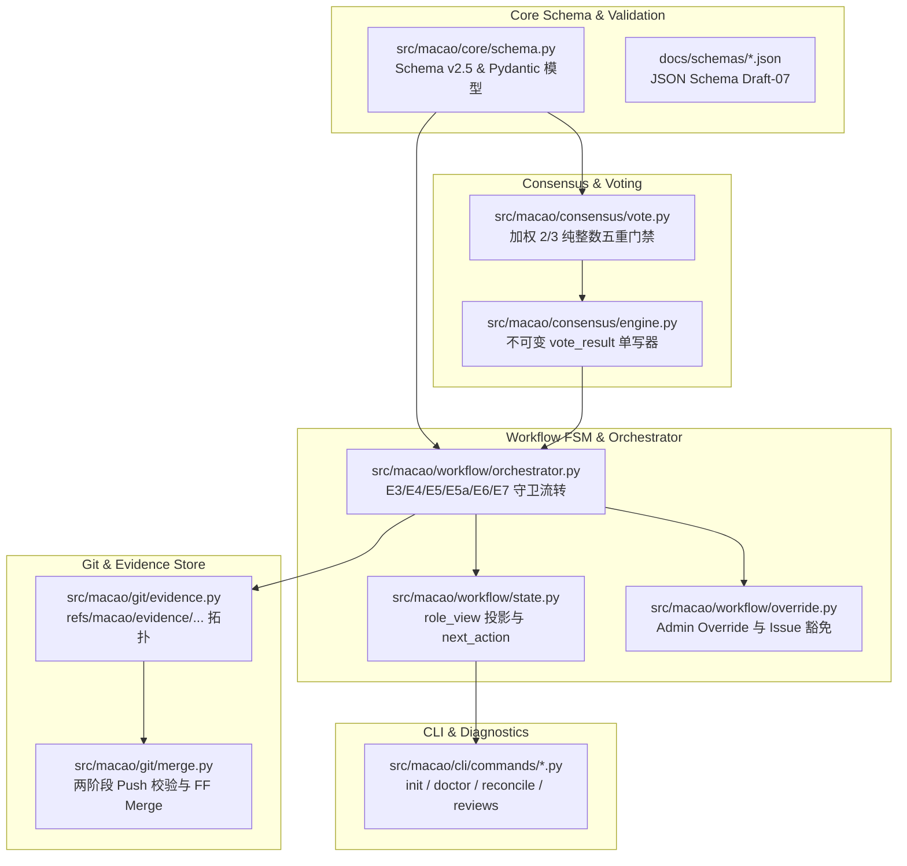

# MACAO v2.5 代码变更清单与实施技术路线

- **基准文档**：[`docs/MACAO_PRD_v2.md`](MACAO_PRD_v2.md)（v2.5 权威基准）
- **变更提案**：[`docs/PRD_CHANGE_PROPOSAL_v2.5.md`](PRD_CHANGE_PROPOSAL_v2.5.md)（DRAFT v0.3 / 评审闭环）
- **事实基线**：[`docs/usercases/PRODUCT-FACTS.md`](usercases/PRODUCT-FACTS.md)（F-1 ～ F-22）
- **日期**：2026-09-01
- **状态**：已冻结待实施（READY-FOR-IMPLEMENTATION）

---

## 1. 变更总体架构与受影响模块

MACAO v2.5 架构升级遵循**「零语义创作、内容与控制分层、独立不可变产物、加权纯整数共识、Git Evidence Ref 隔离」**五大原则。



---

## 2. 模块级代码变更明细清单

### 2.1 契约与 Schema 层（Core Schemas）

| 目标文件 | 变更类型 | 详细变更内容 |
|---|---|---|
| `docs/schemas/dev_manifest.schema.json` | 变更 | 增加 `full_document`（`path`, `evidence_commit`, `sha256`）字段；增加 `task_id` 与 `checkpoint_ref`。 |
| `docs/schemas/review_manifest.schema.json` | 变更 | 1. 升级 `vote` 为三值枚举：`YES_APPROVE`, `NO_APPROVE`, `ABSTAIN`；<br/>2. 增加 `abstain_reason`（ABSTAIN 时必填）；<br/>3. 增加 `items[]`，每项含 `issue_id`, `disposition_class: BLOCKING \| ADVISORY`, `severity`, `title`, `full_document`；<br/>4. 增加条件约束：存在 BLOCKING 则 vote 必为 NO_APPROVE。 |
| `docs/schemas/vote_result.schema.json` | 重构 (v2.0) | 1. 升级 `version: "2.0"`；<br/>2. 增加 `policy_snapshot`（纯整数 5 重门禁配置快照）；<br/>3. 增加 `issues_index` 与 `issues_index_sha256`（原样复制各 Reviewer items，严禁合并）；<br/>4. 增加 `requires_disposition: boolean`；<br/>5. `decision` 包含 `APPROVED`, `REWORK_REQUIRED`, `DEADLOCK`；<br/>6. **彻底移除旧 `issues_summary` 混合写字段与 `issues_to_fix.description` 代写字段**。 |
| `docs/schemas/review_disposition.schema.json` | **新增 (v1.0)** | 定义 Executor 独立处置产物契约：<br/>- `task_id`, `checkpoint_ref`, `review_round`, `executor_id`, `disposition_status: DRAFT \| FINAL`；<br/>- `issues_index_sha256`；<br/>- `dispositions[]`: 逐项 `issue_id`, `disposition_type: ADOPTED \| DEFERRED \| REJECTED \| NEEDS_ADMIN \| EXEMPTED_BY_ADMIN`, `requires_new_checkpoint: boolean`（必填布尔）, `rationale`, `full_document`。 |
| `docs/schemas/admin_override.schema.json` | **新增 (v1.0)** | 定义人工裁决与豁免记录契约：<br/>- `override_id`, `task_id`, `source_state`, `target_state`, `decision`, `exempt_issue_ids[]`, `note`, `actor`, `timestamp`。 |
| `docs/schemas/aep_message.schema.json` | 变更 (AEP/1.1) | 1. 增加第 8 种消息类型 `DISPOSITION_REQUIRED`；<br/>2. 增加 16 KiB 字节预算硬约束（`max_message_bytes = 16384`，内联文本上限 2048 字节）。 |
| `src/macao/core/schema.py` | 变更 | 更新与新增对应 Pydantic 模型与 Schema 验证器类。 |

---

### 2.2 共识与计票引擎（Consensus Engine）

| 目标文件 | 变更类型 | 详细变更内容 |
|---|---|---|
| `src/macao/core/config.py` | 变更 | 1. 增加 `team.reviewers[].vote_weight`（整数，默认 1）；<br/>2. 增加配置期独裁帽校验：$\forall i, 3 \times w_i < 2 \times W$（单席位达到或超过 2/3 总权重直接拒启）。 |
| `src/macao/consensus/vote.py` | 变更 | 实现纯整数 `weighted_2/3_v1` 算术逻辑：<br/>1. 席位法定人数：$E_N \ge \lceil 2N/3 \rceil$；<br/>2. 权重法定人数：$E_W \ge \lceil 2W/3 \rceil$（分母为配置总权重 $W$）；<br/>3. 胜方权重门槛：$3 \times W_{win} \ge 2 \times E_W$；<br/>4. 胜方最少席位门槛：$W_{seats} \ge minimum\_winning\_seats$（默认 2）；<br/>5. 弃权票不进入有效权重 $E_W$。 |
| `src/macao/consensus/engine.py` | 重构 | 1. 确立不可变单一写者：Orchestrator 独占写入 `vote_result.json` 并即时提升至 evidence ref；<br/>2. `DEADLOCK` 判定时**立即落盘** `decision: "DEADLOCK"` 的 `vote_result.json`，随后进入 HOLD；<br/>3. 原样拼接 `issues_index` 并计算 SHA-256，计算 `requires_disposition = len(issues_index) > 0`。 |

---

### 2.3 工作流状态机与调度（Workflow & Orchestrator）

| 目标文件 | 变更类型 | 详细变更内容 |
|---|---|---|
| `src/macao/workflow/state.py` | 变更 | 1. 维护 10 状态单一事实源（`IDLE`, `CODING`, `READY_FOR_REVIEW`, `WAITING_REVIEW`, `CONSENSUS_CHECK`, `MERGING`, `DONE`, `REWORK`, `CANCELLED`, `UNKNOWN`）；<br/>2. 实现 `compute_role_view(task_state, seat_artifacts)`：<br/>   - Executor 在 `CONSENSUS_CHECK` 且 `requires_disposition=true` 且无 FINAL disposition 时投影为 `SHOULD_DISPOSE`；<br/>   - Reviewer 在 `WAITING_REVIEW` 未交票时投影为 `SHOULD_REVIEW`，已交票为 `REVIEW_SUBMITTED`；<br/>   - 产生确定性 `next_action`（如 `NOTIFY_EXECUTOR_DISPOSE`, `TALLY_CONSENSUS` 等）。 |
| `src/macao/workflow/orchestrator.py` | 重构 | 1. **E3 触发守卫**：判定所有配置席位均已 accounted（收到有效 `.review.yml` 或被超时机制计入 accounted），方进入 `CONSENSUS_CHECK`；<br/>2. **E4 守卫**：`decision == APPROVED` 且（无 issue 或存在 FINAL `review_disposition` 精确覆盖 100% issue 且所有 `requires_new_checkpoint == false` 且无未豁免 BLOCKING）$\to$ 转移至 `MERGING`；<br/>3. **E5 守卫**：`decision == REWORK_REQUIRED` $\to$ 转移至 `REWORK` 并发送 `REWORK_REQUEST` + `DISPOSITION_REQUIRED`；<br/>4. **E5a 守卫（新增）**：`decision == APPROVED` 但 FINAL `review_disposition` 中至少有一项 `requires_new_checkpoint == true` $\to$ 转移至 `REWORK`（round+1）；<br/>5. **E6 守卫**：在 `REWORK` 状态下，必须校验前序 round 已存在 FINAL `review_disposition`，且当前提交了新 commit（`!= 上轮 checkpoint_ref`）与新 `.dev.yml`（round+1）$\to$ 转移至 `READY_FOR_REVIEW`；<br/>6. **E7 Override 守卫**：从 HOLD（`CONSENSUS_CHECK` 或 `REWORK`）接收管理员裁定，支持带 `exempt_issue_ids` 豁免，生成 `override_id`，独立写入 `admin_override.json`。 |
| `src/macao/workflow/override.py` | 变更 | 实现管理员接管解析器：支持 `--choice APPROVED|REWORK|RETRY_REVIEW|CANCEL|EXTEND`，验证豁免 issue 存在性，写入审计与回执。 |

---

### 2.4 Git 证据拓扑与合并控制器（Git & Evidence Store）

| 目标文件 | 变更类型 | 详细变更内容 |
|---|---|---|
| `src/macao/git/evidence.py` | **新增** | 实现 Evidence Git Ref 管理器：<br/>1. Ref 拓扑：`refs/macao/evidence/<task_id>/r<round>` 与 inbox `refs/macao/inbox/<task_id>/r<round>/<actor_id>/<message_id>`；<br/>2. 本地暂存（staging）到 canonical evidence ref 的串行 promotion 逻辑；<br/>3. 保持 evidence ref 与源码 commit 完全解耦（独立 tree 与 commit）。 |
| `src/macao/git/merge.py` | 变更 | 1. **两阶段 Push 校验**：<br/>   - Pre-merge Seal：合并前验证 evidence ref 已成功 push 至 remote；<br/>   - Post-merge Seal：源码合并 push 成功后，提交 post-merge audit evidence；若 post-merge push 失败，保持 `MERGING` 重试，**严禁本地回滚已成功的源码分支**；<br/>2. **E4a 硬校验**：校验最终 push 对象哈希精确等于 `vote_result.checkpoint_ref`。 |
| `src/macao/git/worktree.py` | 变更 | 维护 Reviewer 隔离 worktree 生命周期（创建、挂载、fetch、销毁）。 |

---

### 2.5 诊断与 CLI 命令层（CLI & Tooling）

| 目标文件 | 变更类型 | 详细变更内容 |
|---|---|---|
| `src/macao/cli/main.py` | 变更 | 注册 `init`, `doctor`, `reconcile`, `adopt`, `reviews` 子命令组。 |
| `src/macao/cli/commands/init.py` | 变更 | 支持 `--new`（新建项目配置）与 `--adopt-existing`（既有项目接管，歧义时交互式提问管理员）。 |
| `src/macao/cli/commands/doctor.py` | 变更 | 实现只读诊断检查器：收集 SQLite、Git Refs、Worktree、产物状态，输出健康报告，严禁修改任何数据。 |
| `src/macao/cli/commands/reconcile.py` | 变更 | 实现受控状态恢复执行器：按确定性恢复计划执行修复与事务性状态迁移。 |
| `src/macao/cli/commands/reviews.py` | **新增** | 实现 `macao reviews show <task_id> [--round N]` 与 `macao reviews export <task_id> --to <dir>`，从 evidence ref 提取展示评审及处置报告。 |
| `src/macao/cli/commands/status.py` | 变更 | 格式化输出任务 FSM 状态、各席位 `role_view` 投影与系统 `next_action`。 |

---

### 2.6 测试套件（Test Suites）

| 测试文件 | 覆盖内容与断言 |
|---|---|
| `tests/unit/test_consensus_weighted.py` | 覆盖 `weighted_2/3_v1` 五重纯整数门禁全部边界场景：独裁配置拒启、权重达标但席位不足、席位达标但权重不足、纯赞成、纯反对、DEADLOCK 即时落盘。 |
| `tests/unit/test_review_disposition.py` | 覆盖 `review_disposition` Schema 校验、100% 覆盖率校验、遗漏 issue 拒收、未知 issue 拒收、`requires_new_checkpoint` 布尔约束。 |
| `tests/unit/test_fsm_guards_v25.py` | 覆盖 E3 全席位 accounted 触发、E4（全 false 改码）、E5a（含 true 改码进入 REWORK）、E6（前序 round 处置存在性与新 commit 校验）、E7（带豁免的 override）。 |
| `tests/unit/test_evidence_git_ref.py` | 覆盖 evidence ref 创建、inbox promotion、Pre-merge 与 Post-merge 两阶段 push 校验、源码分支 HEAD 洁净性断言。 |
| `tests/integration/test_scenario_disposition_rework.py` | 端到端测试：Executor 开发 $\to$ Reviewer 提出建议 $\to$ 机器 APPROVED $\to$ Executor disposition 标记需要改码 $\to$ E5a 自动进入 REWORK $\to$ 修复后 E6 重新送审 $\to$ 二轮通过合入。 |
| `tests/integration/test_scenario_admin_override.py` | 端到端测试：Reviewer 提出 BLOCKING issue $\to$ 机器 REWORK_REQUIRED $\to$ 管理员通过 E7 豁免该 issue $\to$ 流转至 MERGING 并成功合入。 |

---

## 3. 实施计划与里程碑

```text
Phase 1: 契约与 Schema 升级 (Day 1)
  ├─ 新增 review_disposition / admin_override schemas
  ├─ 升级 vote_result.schema.json (v2.0) & review_manifest (v1.1)
  └─ Pydantic 数据模型与验证器对齐

Phase 2: 加权共识与证据库 (Day 2-3)
  ├─ 实现 weighted_2/3_v1 纯整数五重门禁算法与配置独裁帽
  ├─ 实现 refs/macao/evidence/... 拓扑与 promotion 逻辑
  └─ 实现 vote_result 不可变单一写入与 DEADLOCK 即时落盘

Phase 3: 状态机守卫与处置闭环 (Day 4-5)
  ├─ 实现 Orchestrator E3/E4/E5/E5a/E6/E7 转移守卫
  ├─ 实现 role_view 投影与 next_action 派发
  └─ 实现 Merge Controller 两阶段 Push 校验

Phase 4: CLI 与运维工具链 (Day 6)
  ├─ 实现 init / doctor / reconcile / adopt 命令边界
  ├─ 实现 macao reviews show / export
  └─ 完善 macao status 展示

Phase 5: 全量测试与质量验收 (Day 7)
  ├─ 运行全量单元与场景集成测试
  ├─ 执行 L3 SCENARIO-VERIFIED 回归测试
  └─ 输出 v2.5 正式交付报告
```
